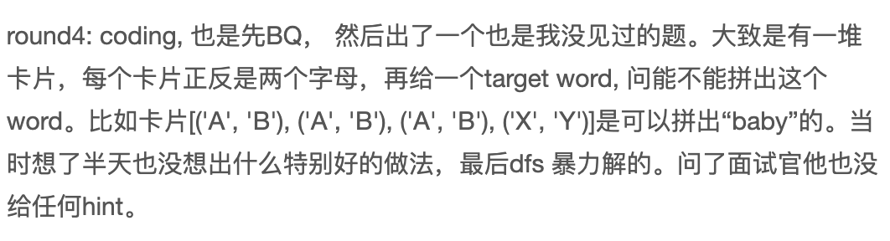

1. [140. Word Break II](https://leetcode.com/problems/word-break-ii)

2. [460. LFU Cache](https://leetcode.com/problems/lfu-cache) **

3. [146. LRU Cache](https://leetcode.com/problems/lru-cache)

4. **Evaluate expression**

    

5. [238. Product of Array Except Self](https://leetcode.com/problems/product-of-array-except-self)

6. [3. Longest Substring Without Repeating Character](https://leetcode.com/problems/longest-substring-without-repeating-characters)

7. [208. Implement Trie (Prefix Tree)](https://leetcode.com/problems/implement-trie-prefix-tree)

8. [121. Best Time to Buy and Sell Stock](https://leetcode.com/problems/best-time-to-buy-and-sell-stock)

9. **form word from cards**

    https://www.1point3acres.com/bbs/thread-862873-1-1.html

    

10. [295. Find Median from Data Stream](https://leetcode.com/problems/find-median-from-data-stream)

11. [224. Basic Calculator](https://leetcode.com/problems/basic-calculator)

12. [1048. Longest String Chain](https://leetcode.com/problems/longest-string-chain)

13. [147. Insertion Sort List](https://leetcode.com/problems/insertion-sort-list)

14. [678. Valid Parenthesis String](https://leetcode.com/problems/valid-parenthesis-string)

15. [127. Word Ladder](https://leetcode.com/problems/word-ladder)

16. [55. Jump Game](https://leetcode.com/problems/jump-game)

17. [694. Number of Distinct Islands](https://leetcode.com/problems/number-of-distinct-islands)

18. [560. Subarray Sum Equals K](https://leetcode.com/problems/subarray-sum-equals-k)

19. [139. Word Break](https://leetcode.com/problems/word-break)

20. [343. Integer Break](https://leetcode.com/problems/integer-break)

21. [225. Implement Stack using Queues](https://leetcode.com/problems/implement-stack-using-queues)

22. [2116. Check if a Parentheses String Can Be Valid](https://leetcode.com/problems/check-if-a-parentheses-string-can-be-valid)

23. [588. Design In-Memory File System](https://leetcode.com/problems/design-in-memory-file-system)

25. [155. Min Stack](https://leetcode.com/problems/min-stack)

26. [162. Find Peak Element](https://leetcode.com/problems/find-peak-element)

27. [207. Course Schedule](https://leetcode.com/problems/course-schedule)

28. **Evaluate Expression - 2**

    https://www.1point3acres.com/bbs/thread-858138-1-1.html

    

28. [26. Remove Duplicates from Sorted Array](https://leetcode.com/problems/remove-duplicates-from-sorted-array)

29. [739. Daily Temperatures](https://leetcode.com/problems/daily-temperatures)

30. [547. Number of Provinces](https://leetcode.com/problems/number-of-provinces)

31. [364. Nested List Weight Sum II](https://leetcode.com/problems/nested-list-weight-sum-ii/)

32. [632. Smallest Range Covering Elements from K Lists](https://leetcode.com/problems/smallest-range-covering-elements-from-k-lists)

33. [239. Sliding Window Maximum](https://leetcode.com/problems/sliding-window-maximum)

34. [merge two BST](https://www.geeksforgeeks.org/merge-two-bsts-with-limited-extra-space/)

35. [1383. Maximum Performance of a Team](https://leetcode.com/problems/maximum-performance-of-a-team)

31. [450. Delete Node in a BST](https://leetcode.com/problems/delete-node-in-a-bst)

## OOD

1. **Locker and package's data models**

    design an optimized algorithm to efficiently fit the package into the right locker

2. **memory management**

    

3. Shopping Cart

    

4. book recommendation system

5. TV show management system

    

6. Card game, game shuffle

7. Linux-find

    https://leetcode.com/discuss/interview-question/609070/Amazon-OOD-Design-Unix-File-Search-API

    

8. File search

9. battle ship

## System Design

1. Rate limiter
1. message queue