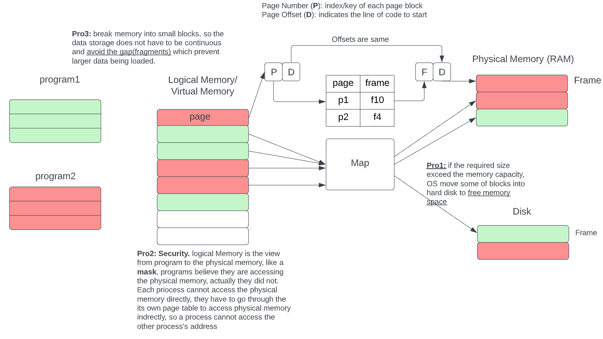

# Interview notes

## Need to consolidate

### Java I/O operation (file)

+ **Stream**: byte based pipe
+ **Reader/Writer**: specifically for reading char streams
    + `FileReader fr = new FileReader("../../x.txt")`
    + `FileWriter fw = new FileWriter("path", boolean append)`
+ **Buffered**: store a chunk of the file into buffer, make reading faster
    + `BufferedReader br =  new BufferedReader(new FileReader(file))  `
    + `BufferedWriter bw = new BufferedWriter(new FileWriter(file, true))`

+ `flush()`, flush everything in the buffer to the destination, if use `FileWriter`, flush has no affect, since `FileWriter` write to the file directly.

### Java http request

[code](https://leetcode.com/playground/bjooYEWN)

```java
URL url = new URL(s);
HttpURLConnection connection = (HttpURLConnection) url.openConnection();
// set up request properties
connection.setRequestMethod("GET");
connection.setConnectTimeout(5000);
connection.setReadTimeout(5000);
BufferedReader br = new BufferedReader(new InputStreamReader(connection.getInputStream()));
```


1. Multi threading

### Exceptions

[code](https://leetcode.com/playground/3JvefKEY)

+ `try/catch/finally`

```java
try{
	// your code
}catch(Exception e1){
	// catch exception
}catch(Exception e2){
    // catch another exception
}finally{
    // no matter what, finally will run, even though
    // there is a return statememnt
}
```

+ `throws/throw`

`Throws` is a keyword is used in a method signature and declares which exceptions can be thrown from a method.  Questions is we can use `try/catch` block to handle those exceptions, why do we need `throws`. What if we have several methods that could throw same exceptions, then we need to use `try/catch` in each methods, which is tedious.

then we can declare what exceptions could be thrown for each methods by using `throws` keyword, and handle it when we call those functions. <u>Please note that `throws` checked exception **must** be handle when we call the methods</u>, java does not verify unchecked Exception

```java
public void function1 ()throws ArithmeticException, NullPointerException{
    
}

public void function2 ()throws ArithmeticException, NullPointerException{
    
}

public void function3 ()throws NullPointerException{
    
}

public static void main(){
    try{
        function1();
        function2();
    }catch{
        
    }
    // below code is valid, java does not verify unchecked exceptions
    try{
        function3();
    }catch(ArithmeticException e){
        ....
    }
}
```

### Multi-Threading

[youtuber](https://www.youtube.com/channel/UCiz26UeGvcTy4_M3Zhgk7FQ)

ReentrantLock

https://aaronice.gitbook.io/system-design/distributed-systems/producer-and-consumer

#### Producer - Consumer

```java
// "static void main" must be defined in a public class.
class Producer implements Runnable{
    private final int id;
    private BlockingQueue<Integer> sharedQueue;
    public Producer(int id, BlockingQueue<Integer> sharedQueue){
        this.id = id;
        this.sharedQueue = sharedQueue;
    }
    @Override
    public void run(){
        for(int i = 0; i < 10; i++){
            try{
                Thread.sleep(100);
                System.out.println("Produced " + i);
                sharedQueue.put(i);
            }catch(Exception e){
                e.printStackTrace();
            }
        }
    }
}

class Consumer implements Runnable{
    private final int id;
    private BlockingQueue<Integer> sharedQueue;
    private Random rand = new Random();
    public Consumer(int id, BlockingQueue<Integer> sharedQueue){
        this.id = id;
        this.sharedQueue = sharedQueue;
    }
    @Override
    public void run(){
        while(true){
            try{
                Thread.sleep(500);
                int r = rand.nextInt(10);
                if(r == 1){
                    System.out.println("Consumer " + id + " Consumed " + sharedQueue.take() + "queue size is " + sharedQueue.size());
                }
            }catch(Exception e){
                e.printStackTrace();
            }
        }
    }
}
public class Main {
    
    public static void main(String[] args) {
        BlockingQueue<Integer> sharedQueue = new LinkedBlockingQueue<>(5);
        Thread p1 = new Thread(new Producer(0, sharedQueue));
        Thread c1 = new Thread(new Consumer(1, sharedQueue));
        Thread c2 = new Thread(new Consumer(2, sharedQueue));
        Thread c3 = new Thread(new Consumer(3, sharedQueue));
        
        p1.start();
        c1.start();
        c2.start();
        c3.start();
        
        try{
            p1.join();
            c1.join();
            c2.join();
            c3.join();
            
        }catch(Exception e){
            e.printStackTrace();
        }
    }
}
```


### Resolve hash conflict

+ hash and validate


### Process vs Threads

#### Terms

+ **CPU vs Core**: basically CPU contains multiple core, and core is small processor to run instructions, while CPU  has other unit such as memory, I/O controller ... Two thread running on one core at the same time, but the processor can switch execution resources between threads, resulting in concurrent execution. Concurrency indicates that more than one thread is making progress, but the threads are **not actually running simultaneously.**

#### Process

+ **Defintion**:Each process can have multiple threads (constructions sites have different workers). We usually use processes when we need to process or perform an **extremely heavy** taks. The reason for that are:

  +  because the **overhead** required to create a process a quite big, 

  + **context switch** among process are slower than threads, process context switching takes more time and is done by the operating system, while thread context switch takes less time and does not require an **operating system call** (see details in Context switch section below)

  + and also the **communication** among processes is quitely costly since they do not share memory of any kind.

#### Thread

+ **Definition**: <u>a thread can do anything a process can do</u>. The main difference here is memory sharing. Threads are usually used for performing **small tasks**.


#### Context Switch Process vs Thread

| Process Context Switch(PCS)                                  | Thread Context Switch (TCS)                                  |
| ------------------------------------------------------------ | ------------------------------------------------------------ |
| Switch memory address spaces, all the memory addresses that the processor accounts get flushed | does not involves switching of memory address spacess, all the memory addresses that the processor accounts remain saved |
| Processor's cache and Translational Lookaside Buffer (TLB) get flushed | TLB and cache preserves their state                          |
| Heavy cost of switching address space, less efficient        | it switches registers and stack pointers (no memory addresses switch), more efficient |

TLB: a special cache used to keep track of recently used transactions, it contains the page table entries that been most recently used (LRU cache).

#### Memory Paging

[video_1](https://www.youtube.com/watch?v=qlH4-oHnBb8)

[video_2](https://www.youtube.com/watch?v=pJ6qrCB8pDw&t=587s)



## Interview Track

4: no idea how to solve

5: have idea, did not finish implementation

6: finish implementation but wrong answer or solved by brute force

7: get a working solution, did not solve the follow up

8: get a working solution, no bug and answered follow up (or no follow up)

| Company               | Round         | Note                                                         |
| --------------------- | ------------- | ------------------------------------------------------------ |
| MixPanel (6.5; Offer) | Round1,1-28   | 7, Asked Java IO API, questions: read last 10 lines of large file |
|                       | round-2 1-11  | 8, work experience                                           |
|                       | round-3 1-11  | 5, flatten nested list, without precomputation               |
|                       | round-4 2-14  | 6, poker                                                     |
|                       | round-5 2-14  | 7, directory BFS, follow up: content is large                |
| Amazon(7; no offer)   | OA, 3-15      | see OA notes                                                 |
|                       | Round-1; 3-29 | 8; most freq subtree sum                                     |
|                       | Round-2; 3-29 | 7;(simple question not sure if I get right understanding) parking system |
|                       | Round-3; 3-30 | 8; given n and k, find all integer with n digits and consecutive digits diff is k |
|                       | Round-4; 3-30 | 5; find a edge that breaks the tree property, LC(685)        |
