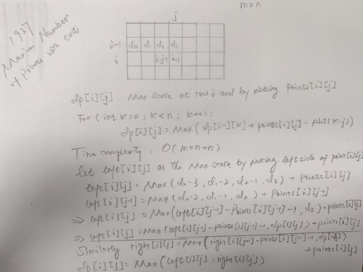

# Dynamic programming

## General Idea

1. [300. Longest Increasing Subsequence -- Medium](https://leetcode.com/problems/longest-increasing-subsequence)

1. [368. Largest Divisible Subset -- Medium](https://leetcode.com/problems/largest-divisible-subset/) dp with res instead of number

2. [673. Number of Longest Increasing Subsequence](https://leetcode.com/problems/number-of-longest-increasing-subsequence/)

2. [718. Maximum Length of Repeated Subarray -- Medium](https://leetcode.com/problems/maximum-length-of-repeated-subarray/)

3. [560. Subarray Sum Equals K](https://leetcode.com/problems/subarray-sum-equals-k/)

   Note that `k` could be negative, which needs offset for **memoize**. 

   This can also be solved by using **Prefix Sum** along with `HashMap`

   ```java
   class Solution {
       public int subarraySum(int[] nums, int k) {
           int ans = 0;
           for(int i = 0; i < nums.length; i++){
               ans += dp(nums, k, i);
           }
           return ans;
       }
       // number of CS that end at index
       public int dp(int[] nums, int k, int index){
           if(index == 0) return nums[index] == k ? 1 : 0;
           int res = 0;
           if(nums[index]==k) res +=1;
           return res + dp(nums, k - nums[index], index - 1);
       }
   }
   ```

   

4. [72. Edit Distance -- Hard](https://leetcode.com/problems/edit-distance/)

5. [10. Regular Expression Matching -- Hard](https://leetcode.com/problems/regular-expression-matching/) use DP for string match

6. [276. Paint Fence -- Medium](https://leetcode.com/problems/paint-fence) does not need to check condition

7. [740. Delete and Earn -- Medium](https://leetcode.com/problems/delete-and-earn)

8. [446. Arithmetic Slices II - Subsequence -- Hard](https://leetcode.com/problems/arithmetic-slices-ii-subsequence/) use `Map<Integer, Integer>[]` for `dp[i][j]` when j could be negative

9. [322. Coin Change -- Medium](https://leetcode.com/problems/coin-change)

10. [983. Minimum Cost For Tickets -- Hard](https://leetcode.com/problems/minimum-cost-for-tickets/)

11. [978. Longest Turbulent Subarray -- Medium](https://leetcode.com/problems/longest-turbulent-subarray)

12. [413. Arithmetic Slices -- Medium](https://leetcode.com/problems/arithmetic-slices/)

15. [795. Number of Subarrays with Bounded Maximum -- Medium](https://leetcode.com/problems/number-of-subarrays-with-bounded-maximum)

12. [1220. Count Vowels Permutation -- Hard](https://leetcode.com/problems/count-vowels-permutation/)

### Do not know where to start or where to stop

1. [1130. Minimum Cost Tree From Leaf Values -- Medium](https://leetcode.com/problems/minimum-cost-tree-from-leaf-values/)
2. [410. Split Array Largest Sum -- Hard](https://leetcode.com/problems/split-array-largest-sum/)
3. [1335. Minimum Difficulty of a Job Schedule -- Hard](https://leetcode.com/problems/minimum-difficulty-of-a-job-schedule/)
4. [152. Maximum Product Subarray -- Medium](https://leetcode.com/problems/maximum-product-subarray/) + [53. Maximum Subarray](https://leetcode.com/problems/maximum-subarray/)


## Bit mask to store state

1. [1066. Campus Bikes II -- Medium](https://leetcode.com/problems/campus-bikes-ii/)

## Intervals

**Optimal of large interval depends on optimal of sub intervals**;

+ k intervals, we can get 1 interval first then get k - 1 intervals from rest of element

1. [546. Remove Boxes -- Hard](https://leetcode.com/problems/remove-boxes)
2. [312. Burst Balloons -- Hard](https://leetcode.com/problems/burst-balloons)
3. [1000. Minimum Cost to Merge Stones -- Hard](https://leetcode.com/problems/minimum-cost-to-merge-stones/)
4. [1547. Minimum Cost to Cut a Stick -- Hard](https://leetcode.com/problems/minimum-cost-to-cut-a-stick)
5. [488. Zuma Game -- Hard](https://leetcode.com/problems/zuma-game)
6. [410. Split Array Largest Sum -- Hard](https://leetcode.com/problems/split-array-largest-sum/)
7. 516
8. 375
9. 1682
10. 1745
11. [96. Unique Binary Search Trees -- Medium](https://leetcode.com/problems/unique-binary-search-trees/)


## Only two rows are needed for each iteration

1. [265. Paint House II -- Hard](https://leetcode.com/problems/paint-house-ii)

## predict future instead of get current by past

1. 2044


## Job scheduling series


## Sell Stock Series

1. [121. Best Time to Buy and Sell Stock -- Easy](https://leetcode.com/problems/best-time-to-buy-and-sell-stock)
2. [122. Best Time to Buy and Sell Stock II -- Easy](https://leetcode.com/problems/best-time-to-buy-and-sell-stock-ii) 
3. [123. Best Time to Buy and Sell Stock III -- Hard](https://leetcode.com/problems/best-time-to-buy-and-sell-stock-iii)
4. [Best Time to Buy and Sell Stock IV -- Hard](https://leetcode.com/problems/best-time-to-buy-and-sell-stock-iv/)

## Path / Path Sum

1. [Unique Paths -- Medium](https://leetcode.com/problems/unique-paths/)
2. [63. Unique Paths II -- Medium](https://leetcode.com/problems/unique-paths-ii)
3. [Unique Paths III -- Hard](https://leetcode.com/problems/unique-paths-iii/)
4. [64. Minimum Path Sum -- Medium](https://leetcode.com/problems/minimum-path-sum)
5. [1937. Maximum Number of Points with Cost -- Medium](https://leetcode.com/problems/maximum-number-of-points-with-cost/)
6. [741. Cherry Pickup -- Hard](https://leetcode.com/problems/cherry-pickup/)
7. [174. Dungeon Game -- Hard](https://leetcode.com/problems/dungeon-game/)
8. [120. Triangle -- Hard](https://leetcode.com/problems/triangle)

## Binary numbers

1. [600. Non-negative Integers without Consecutive Ones -- Hard](https://leetcode.com/problems/non-negative-integers-without-consecutive-ones/) need more time


## Parenthesis

1. [678. Valid Parenthesis String -- Medium](https://leetcode.com/problems/valid-parenthesis-string/)


## Play game

### Take turns

we use `dp(...)` to indicate **<u>general any player's score</u>** instead of the player that problems asks for

[1140. Stone Game II](https://leetcode.com/problems/stone-game-ii/)

```java
private int dp(int[] piles, int[] stonesLeft, int M, int start){
        if(start + 2 * M >= piles.length) return stonesLeft[start];
        if(memo[start][M] != -1) return memo[start][M];
        int score = 0;
        for(int i = 1; i <= 2 * M && start + i < piles.length; i++){
            int curScore = stonesLeft[start] - stonesLeft[start + i]
                + stonesLeft[start + i] - dp(piles, stonesLeft, Math.max(M, i), start + i); 
            score = Math.max(score, curScore);
        }
        return memo[start][M] = score;
    }
```

Lets say we have two players: A and B,

 ` A_maxScore = score(A's current pick) + ( remaining_score - B_maxScore) `

1. [877. Stone Game](https://leetcode.com/problems/stone-game)
2. [1140. Stone Game II](https://leetcode.com/problems/stone-game-ii)

3. [1406. Stone Game III](https://leetcode.com/problems/stone-game-iii)
4. [1510. Stone Game IV](https://leetcode.com/problems/stone-game-iv)
5. [1563. Stone Game V](https://leetcode.com/problems/stone-game-v)
6. [1686. Stone Game VI](https://leetcode.com/problems/stone-game-vi) **intuition**: Sort stones by their sum value for Alice and Bob.
   If a stone is super valued for Alice, Alice wants to take it.
   If a stone is super valued for Bob, Alice also wants to take it.
   Because she doesn't want Bob to take it.
7. [1510. Stone Game IV](https://leetcode.com/problems/stone-game-iv)
8. [1872. Stone Game VIII --  Hard](https://leetcode.com/problems/stone-game-viii/)


## Jump Game

1. [55. Jump Game -- Medium](https://leetcode.com/problems/jump-game)
2. [45. Jump Game II -- Medium](https://leetcode.com/problems/jump-game-ii) / [1326. Minimum Number of Taps to Open to Water a Garden -- Hard](https://leetcode.com/problems/minimum-number-of-taps-to-open-to-water-a-garden/)
3. [871. Minimum Number of Refueling Stops -- Hard](https://leetcode.com/problems/minimum-number-of-refueling-stops/)

## Palindrome Partitioning (backtracking + memoization)

[131. Palindrome Partitioning](https://leetcode.com/problems/palindrome-partitioning) be flexible, use **memoization** whenever it is needed. here use memo for checking palindromic

[132. Palindrome Partitioning II -- Hard](https://leetcode.com/problems/palindrome-partitioning-ii) if it is hard to find relationship between `dp[i]` and `dp[i - 1]`, just try loop through `j` to find equations of `dp[i][j]` and `dp[i - n][j - m]`

[1278. Palindrome Partitioning III -- Hard](https://leetcode.com/problems/palindrome-partitioning-iii)

[1745. Palindrome Partitioning IV --  Hard](https://leetcode.com/problems/palindrome-partitioning-iv)

## Some good problems in DP

[1000. Minimum Cost to Merge Stones -- Hard](https://leetcode.com/problems/minimum-cost-to-merge-stones/) 

```java
class Solution {
    int k;
    int[] preSum;
    Integer[][][]memo;
    public int mergeStones(int[] stones, int k) {
        // the last step merge cost will always be sum(stones)
        // so problem becomes merge stones into k piles, then merge into one piles
        // we can divide the problem "merge into k piles" into two sub problems
        // merge one side in to k - 1 piles, while another side into 1 pile
        
        // also we can see stones  as (k - 1), (k - 1), ... (k - 1), 1
        // so  x*(k - 1) + 1 = len, there will be a solution only when (len - 1) % (k - 1) = 0
        
        this.k = k;
        int m = stones.length;
        preSum = new int[stones.length];
        preSum[0] = stones[0];
        memo = new Integer[m][m][k + 1];
        for(int i = 1; i < stones.length; i++){
            preSum[i] = stones[i] + preSum[i - 1];
        }
        int ans = dp(stones, 0, stones.length - 1, 1);
        return ans == Integer.MAX_VALUE ? -1 : ans;
    }
    // return min cost to form target number of piles by using from ith to jth stone
    private int dp(int[] stones, int i, int j, int target){
        // base case
        if(j - i + 1 < target) return Integer.MAX_VALUE;
        if(i == j) return target == 1 ? 0 : Integer.MAX_VALUE;
        if(memo[i][j][target] != null) return memo[i][j][target];
        int minCost = Integer.MAX_VALUE;
        if(target == 1){
            int temp = dp(stones, i, j, k);
            if(temp != Integer.MAX_VALUE){// can be merged into k piles
                minCost = temp + preSum[j] - (i - 1 >= 0 ? preSum[i - 1] : 0 );
            }else{
                minCost = Integer.MAX_VALUE;
            }
            return memo[i][j][target] = minCost;
        }
        // we need to partition the array to two part, one part form target - 1 piles
        // another form 1 piles, m here is the end of the left part
        for(int m = i; m < j; m++){
            int left = dp(stones, i, m, target - 1);
            int right = dp(stones, m + 1, j, 1);
            if(left != Integer.MAX_VALUE && right != Integer.MAX_VALUE){
                minCost = Math.min(left + right, minCost);
            }
        }
        return memo[i][j][target] = minCost;
    }
```

[1937. Maximum Number of Points with Cost -- Medium ](https://leetcode.com/problems/maximum-number-of-points-with-cost/)




[764. Largest Plus Sign -- Medium](https://leetcode.com/problems/largest-plus-sign)

## Compression


## String Matching

[115. Distinct Subsequences -- Hard](https://leetcode.com/problems/distinct-subsequences)

