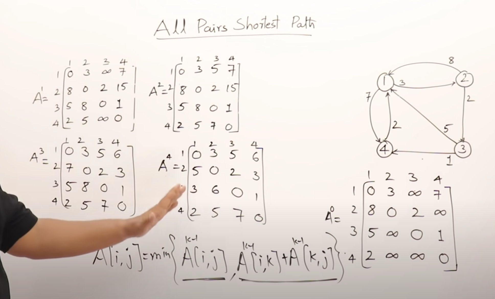
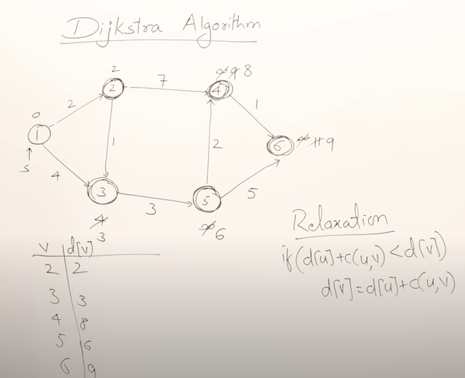
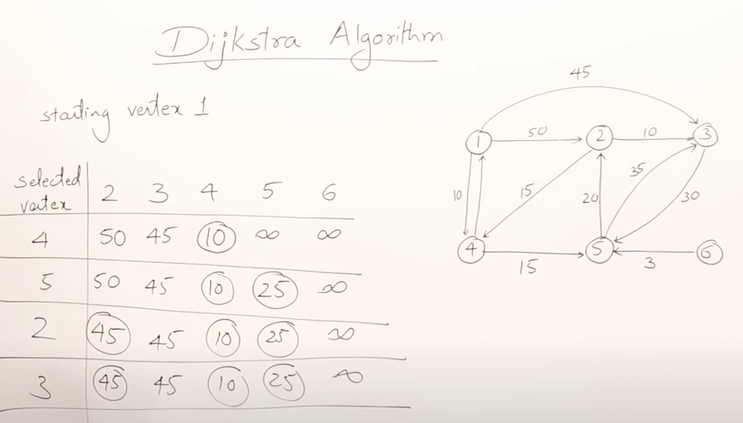
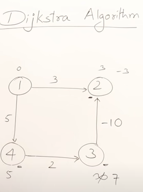
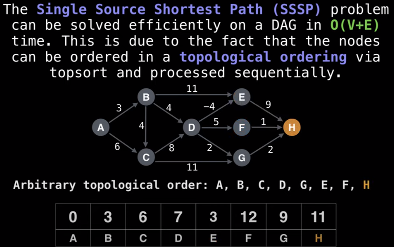
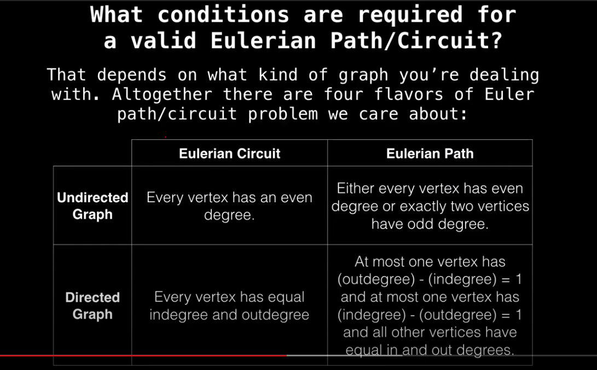

# Graph

1. [1466. Reorder Routes to Make All Paths Lead to the City Zero](https://leetcode.com/problems/reorder-routes-to-make-all-paths-lead-to-the-city-zero/) bfs check neighbor(only one way between different cities)


## BFS

1. [45. Jump Game II -- Medium](https://leetcode.com/problems/jump-game-ii/)

## Union find, disjoint set

**union find is good for**

+ find the cycle in graph
+ Group nodes

Every time we see relation is **transitive, merge, divide into different groups**, for example, <u>A and B are friend, B and C are friend, then A and C are friend, or A can reach B and B can reach C, then A can reach C as well,</u> In this case, we can use `union()` to group components with the same relations, and use `find()` to get the root (represent of the group) of two components to see if they are in the same group 

```java
public boolean UnionFind(List<List<String>> edges) {
        
    // union similar words into groups

    // parents array, m is total number of nodes
    int[] parents = new int[m];

    // negative indicates node i is the root (represent of the group)
    // and magnitude is the rank of the node (total number of nodes in the group)
    // if positive, it indicates the index of the parents
    Arrays.fill(parents, -1);
    // if the node is not number, we need to map word to ID
    Map<String, Integer> nodeToId = new HashMap<>();
    int id = 0;

    // loop each group and union similar component into a group
    for(List<String> edge : edges){
      union(edge.get(0), edge.get(1));
    }

    // now we have groups in which components share same relation or characteristics
    // do something specific
  
  
     private void union(int a, int b, int[] parents){
        int pa = find(a, parents);
        int pb = find(b, parents);
        if(pa == pb) return;// here is a cycle, since a and b are already in a group, but they share the same parent.
        if(Math.abs(parents[pa]) > Math.abs(parents[pb])){
            parents[pa] += parents[pb];
            parents[pb] = pa;
        }else if(Math.abs(parents[pa]) < Math.abs(parents[pb])){
            parents[pb] += parents[pa];
            parents[pa] = pb;
        }else{
            parents[pa] += parents[pb];
            parents[pb] = pa;
        }
    }
    
    private int find(int a, int[] parents){
        if(parents[a] < 0){// itself is the root;
            return a;
        }else{
            return find(parents[a], parents);
        }
    }
```

[**Leetcode problems**](https://leetcode.com/tag/union-find/)

1. [721. Arrange Accounts](https://leetcode.com/problems/accounts-merge/solution/)

2. [547. Number of Provinces](https://leetcode.com/problems/number-of-provinces/)

3. [737. Sentence Similarity II](https://leetcode.com/problems/sentence-similarity-ii/)

   ### View cell in matrix as vertex 

4. [200. Number of Islands -- Medium](https://leetcode.com/problems/number-of-islands/)

5. [827. Making A Large Island -- Hard](https://leetcode.com/problems/making-a-large-island/), to group distinct islands

6. [959. Regions Cut By Slashes -- Medium](https://leetcode.com/problems/regions-cut-by-slashes/)

7. [947. Most Stones Removed with Same Row or Column -- Medium](https://leetcode.com/problems/most-stones-removed-with-same-row-or-column/)

8. [128. Longest Consecutive Sequence -- Medium](https://leetcode.com/problems/longest-consecutive-sequence/) apply union find 

9. [Is Graph Bipartite? -- Medium](https://leetcode.com/problems/is-graph-bipartite)

### View row and col as vertex

10. [1632. Rank Transform of a Matrix --  Hard](https://leetcode.com/problems/rank-transform-of-a-matrix)

### Weighted union and find

1. [399. Evaluate Division -- Medium](https://leetcode.com/problems/evaluate-division/)
2. [990. Satisfiability of Equality Equations -- Medium](https://leetcode.com/problems/satisfiability-of-equality-equations/)


## DFS  / Topological sorting

### DFS find Cycle in DAG (Directed Acylic Graph)

`visiting` state means a node A is being visiting, if later on we visit A again, which mean there is a cycle

```java
public boolean findCycle(int numCourses, int[][] prerequisites) {
        // use DFS to find the cycle
        // 0: unvisited, 1: visiting, 2: visited
        int[] state = new int[numCourses];
        List<List<Integer>> graph = new LinkedList<>();
        
        for(int i = 0; i < numCourses; i++){
            graph.add(new LinkedList<>());
        }
        
        for(int [] pre : prerequisites){
            graph.get(pre[1]).add(pre[0]);
        }
        
        for(int i = 0; i < numCourses; i++){
            if(dfs(graph, i, state)){
                return false;
            }
        }
        return true;
    }
    
    private boolean dfs(List<List<Integer>> graph, int cur, int[] state){
        if(state[cur] == 1) return true;
        if(state[cur] == 2) return false;
        state[cur] = 1;
        for(int dependency : graph.get(cur)){
            if(dfs(graph, dependency, state)) return true;
        }
        state[cur] = 2;
        return false;
    }
```

### Find separate group by DFS

1. [323. Number of Connected Components in an Undirected Graph](https://leetcode.com/problems/number-of-connected-components-in-an-undirected-graph/)

2. [1059. All Paths from Source Lead to Destination](https://leetcode.com/problems/all-paths-from-source-lead-to-destination/) detect cycle in defined paths

### Top Sort

given a **directed acyclic graph (DAG)**, a topological sort is a linear ordering of all vertices such that for any edge `(u, v)`, `u` comes before `v`. Another way to describe it is that when you put all vertices horizontally on a line, all of the edges are pointing from left to right.

```java
public int[] findOrder(int numCourses, int[][] prerequisites) {
        // use topological sort 
        List<List<Integer>> graph = new LinkedList<>();
        for(int i = 0; i < numCourses; i++){
            graph.add(new LinkedList<>());
        }
        
        for(int [] pre : prerequisites){
            graph.get(pre[1]).add(pre[0]);
        }
        
        Stack<Integer> stack = new Stack<>();
        int[] state = new int[numCourses];
        
        for(int i = 0; i < numCourses; i++){
            if(topoSort(graph, i, state, stack)){
                return new int[0];
            }; 
        }
        int[] ans = new int[numCourses];
        int i = 0;
        while(!stack.isEmpty()){
            ans[i++] = stack.pop();
        }
        return ans;
    }
    
    private boolean topoSort(List<List<Integer>> graph, int cur, int[] state, Stack<Integer> stack){
        // check if cur is visited
        if(state[cur] == 1) return true;
        if(state[cur] == 2) return false;
        state[cur] = 1;
        // explore all its child
        for(int child : graph.get(cur)){
            if(topoSort(graph, child, state, stack)){
                return true;
            };
        }
        // now all child of cur have been explored
        state[cur] = 2;
        stack.add(cur);
        return false;
    }
```


**Difference** with regular `DFS` is that Top sort return the sequence by pushing `curNode` into stack after it is fully explored (all its child are visited);

1. [207. Course Schedule  --  Medium](https://leetcode.com/problems/course-schedule/)
2. [210. Course Schedule II -- Medium](https://leetcode.com/problems/course-schedule-ii/)
3.  [269. Alien Dictionary -- Hard](https://leetcode.com/problems/alien-dictionary/)


## Find shortest distance between given two nodes in a graph

### [Floyd-Warshall Algorithm](https://www.youtube.com/watch?v=oNI0rf2P9gE) 

to find longest distance, just multiply the weight with -1 then find shortest one.



1. [1334. Find the City With the Smallest Number of Neighbors at a Threshold D -- Medium](https://leetcode.com/problems/find-the-city-with-the-smallest-number-of-neighbors-at-a-threshold-distance/)
2. [1462. Course Schedule IV -- Medium](https://leetcode.com/problems/course-schedule-iv/) boolean matrix

### [Dijkstra Algorithm](https://www.youtube.com/watch?v=XB4MIexjvY0)





**Dijkstra is <u>NOT</u> friendly with negative cost**



[source code](https://leetcode.com/playground/93uryw5m)

```java
private int[] dijkstra(Map<Integer, List<int[]>> graph, int n, int start){
        PriorityQueue<int[]> queue = new PriorityQueue<>((a, b) -> a[1] - b[1]);
        Set<Integer> settled = new HashSet<>();
        int[] distance = new int[n];
        Arrays.fill(distance, Integer.MAX_VALUE);
        // start point is 0
        queue.offer(new int[]{start, 0});
        distance[start] = 0;
        while(settled.size() != n){
            int[] cur = queue.poll(); // pick up the node with min cost
            settled.add(cur[0]);
            relax(graph, settled, queue, distance, cur[0]);
        }
        return distance;
    }
    private void relax(Map<Integer, List<int[]>> graph, Set<Integer> settled, PriorityQueue<int[]> queue, int[] distance, int cur){
       
        if(graph.get(cur) ==  null) return;
        for(int[] nei : graph.get(cur)){
            int to = nei[0];
            int cost = nei[1];
            if(!settled.contains(to) && distance[cur] + cost < distance[to]){
                distance[to] = distance[cur] + cost;
                queue.offer(new int[]{to, distance[to]});
            }
        }
    }
```

**Questions:** 

[505. The Maze II --  Medium](https://leetcode.com/problems/the-maze-ii/)

### Linear way

https://github.com/williamfiset/Algorithms/blob/master/src/main/java/com/williamfiset/algorithms/graphtheory/TopologicalSortAdjacencyList.java



##  Eulerian Path / Circuits

**Eulerian Path**: a path of edges that <u>visits all the edges</u> in a graph <u>exactly once</u>.

**Eulerian Circuit**:  a Eulerian path starts and ends at the same vertex



And all vertices with non-zero degree need to belong to a single connected component


## Tarjan Algorithm: find the bridge of the graph

**basic idea: give the label/rank to each node when dfs, the rank should increase, there is a cycle if the rank goes down during dfs, we return when that occurs, and all nodes with higher ranks than the return value are part of cycle**

```java
public List<List<Integer>> criticalConnections(int n, List<List<Integer>> connections) {
        // make graph
        Map<Integer, List<Integer>> map = new HashMap<>();
        Set<Pair<Integer, Integer>> uniqueC = new HashSet<>();
        for(List<Integer> connection : connections){
            map.computeIfAbsent(connection.get(0), x->new ArrayList<>()).add(connection.get(1));
            map.computeIfAbsent(connection.get(1), x->new ArrayList<>()).add(connection.get(0));
            uniqueC.add(new Pair<Integer, Integer>(Math.min(connection.get(0), connection.get(1)), Math.max(connection.get(0), connection.get(1))));
        }
        int[] rank = new int[n];
        Arrays.fill(rank, -1); // -1 means not visited
        // dfs if cur rank is smaller than the prev rank, cycle
        dfs(map, rank, uniqueC, 0, -1, 0);
        List<List<Integer>> ans = new ArrayList<>();
        for(Pair<Integer,Integer> a : uniqueC){
            List<Integer> temp = new ArrayList<>();
            temp.add(a.getKey());
            temp.add(a.getValue());
            ans.add(temp);
        }
        return ans;
    }
    private int dfs(Map<Integer, List<Integer>> map, int[] rank, Set<Pair<Integer, Integer>> uniqueC, int cur, int prev, int curRank){
        if(rank[cur] >= 0) return rank[cur];// go back visit a node twice, cycle
        rank[cur] = curRank;
        int minRank = Integer.MAX_VALUE;
        for(int nei : map.get(cur)){
            if(nei == prev) continue;
            int nextRank = dfs(map, rank, uniqueC, nei, cur, curRank + 1);
            if(rank[cur] >= nextRank) uniqueC.remove(new Pair<Integer, Integer>(Math.min(nei, cur), Math.max(nei, cur)));
            minRank = Math.min(minRank, nextRank);
        }
        return minRank;
    }
```


1. [192. Critical Connections in a Network -- Hard](https://leetcode.com/problems/critical-connections-in-a-network/)

   

## Kruskal Algorithm: find minimum spanning tree

**MST**: A **minimum spanning tree** (**MST**) or **minimum weight spanning tree** is a subset of the edges of a [connected](https://en.wikipedia.org/wiki/Connected_graph), edge-weighted undirected graph that connects all the [vertices](https://en.wikipedia.org/wiki/Vertex_(graph_theory)) together, without any [cycles](https://en.wikipedia.org/wiki/Cycle_(graph_theory)) and with the minimum **possible total edge weight**, if all N nodes are connected, MST will have N - 1 edges

[**Video link**](https://www.youtube.com/watch?v=4ZlRH0eK-qQ)

+ sort edges based on weight in non-decreasing order
+ loop through each edge, check two nodes connected by that edge are in the same group, if **yes**, that means node1 can access the node2 from other path which is accessed before (since the edge is sorted by weight in non-decreasing order, the earlier path costs less), ignore this edge. if **no**,  and union two nodes and add the edge into the spanning tree set.

1. [1135 Connecting Cities With Minimum Cost -- Medium](https://leetcode.com/problems/connecting-cities-with-minimum-cost/)
2. [1168. Optimize Water Distribution in a Village -- Hard](https://leetcode.com/problems/optimize-water-distribution-in-a-village/)


**[Code Template](https://leetcode.com/playground/new/empty)**

```java
 public int minimumCost(int n, int[][] connections) {
        // kruskal, always choose the mincost edge
   			// if make a cycle, ingonre it, since cheaper edge counted earlier 
        int[] parent = new int[n + 1];
        int ans = 0, connectedEdges = 0;
        Arrays.fill(parent, -1);
        Arrays.sort(connections, (a, b) -> a[2] - b[2]);
        for(int[] connection : connections){
            int p1 = find(connection[0], parent);
            int p2 = find(connection[1], parent);
            if(p1 == p2) continue;
            union(connection[0], connection[1], parent);
            ans += connection[2];
            connectedEdges ++;
        }
        if(connectedEdges == n - 1){
            return ans;
        }else{
            return -1;
        }
    }
    
    private boolean union(int a, int b, int[] parent){...}
    
    private int find(int a, int[] parent){...}
```

## to be categorized

[1761. Minimum Degree of a Connected Trio in a Graph -- Hard](https://leetcode.com/problems/minimum-degree-of-a-connected-trio-in-a-graph/)

