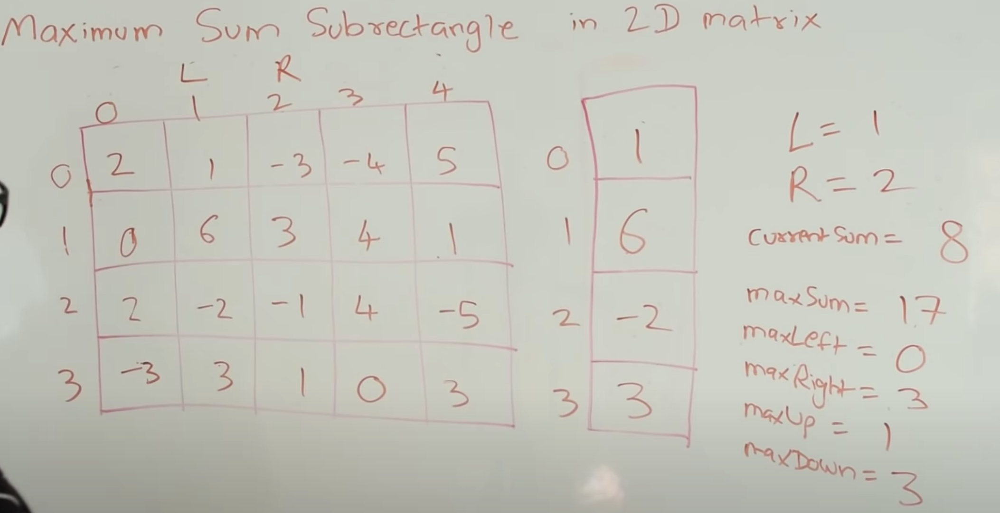

# Matrix

## Diagonal Transverse

+ elements at the same diagonal have the **same sum of x index and y index**

  

+ elements at the same anti-diagonal have the same **difference of x index and y index**

+ use `HashTable` to store element with same ordinates sum

#### Problems:

1. [Diagonal Transverse](https://leetcode.com/problems/diagonal-traverse/) 
2. [Diagonal Transverse II](https://leetcode.com/problems/diagonal-traverse-ii/)


## Rotate Image


## Spiral Transverse

+ use left, right, up and bottom **boundaries**

1. [54. Spiral Matrix -- Medium](https://leetcode.com/problems/spiral-matrix)
2. [59. Spiral Matrix II -- Medium](https://leetcode.com/problems/spiral-matrix-ii)


## Search Sorted Matrix

Idea: elements on the right side are larger and elements on the top are smaller, then <u>search either from bottom left or top right</u>, **template**:

```java
public boolean searchMatrix(int[][] matrix, int target) {
        //search from either from bottom left corner or top right corner
        int height = matrix.length;
        if(height <= 0) return false;
        int width = matrix[0].length;
        int row = height - 1;
        int col = 0;
        while(row >= 0 && col < width){
            if(matrix[row][col] == target){
                return true;
            }else if(matrix[row][col] < target){
                col ++;
            }else{
                row --;
            }
        }
        return false;
    }
```

1. [74. Search a 2D Matrix -- Medium](https://leetcode.com/problems/search-a-2d-matrix/)
2. [240. Search a 2D Matrix II -- Medium](https://leetcode.com/problems/search-a-2d-matrix-ii/)
3. [378. Kth Smallest Element in a Sorted Matrix](https://leetcode.com/problems/kth-smallest-element-in-a-sorted-matrix/)
4. [1428. Leftmost Column with at Least a One -- Medium](https://leetcode.com/problems/leftmost-column-with-at-least-a-one/) linear search from top-right or binary search (<u>boundary</u>)


## Sub rectangle sum / area

[video tutorial](https://www.youtube.com/watch?v=yCQN096CwWM), basically try  sub rectangles with different **left boundary** and **right boundary**, then use **<u>Kadane's algorithm</u>** to find the maxSum and track the **upper boundary** and **lower boundary**



#### problems

1. [304. Range Sum Query 2D - Immutable -- Medium](https://leetcode.com/problems/range-sum-query-2d-immutable/submissions/)

2. [363. Max Sum of Rectangle No Larger Than K --  Hard](https://leetcode.com/problems/max-sum-of-rectangle-no-larger-than-k/) need to think about another constraint, `maxSum <= k`

3. [221. Maximal Square -- Medium](https://leetcode.com/problems/maximal-square/)

### We can see the problem as Histogram 

1. [84. Largest Rectangle in Histogram -- Hard](https://leetcode.com/problems/largest-rectangle-in-histogram/) divide and conquer method is interesting

2. [85. Maximal Rectangle -- Hard](https://leetcode.com/problems/maximal-rectangle/) 


### 2D to 1D

[764. Largest Plus Sign -- Medium](https://leetcode.com/problems/largest-plus-sign)

## Multiple sources BFS

1. [542. 01 Matrix -- Medium](https://leetcode.com/problems/01-matrix/), search from all destinations to starts

s

