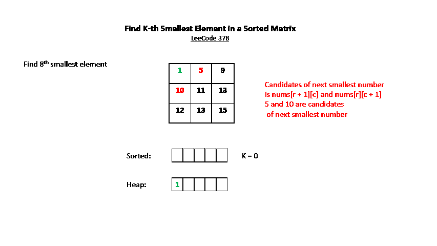

# Stack

## Mono increasing / decreasing stack

1. [901. Online Stock Span -- Medium](https://leetcode.com/problems/online-stock-span/)
2. [Daily Temperatures](https://leetcode.com/problems/daily-temperatures/)
3. [496. Next Greater Element I](https://leetcode.com/problems/next-greater-element-i/)
4. [84. Largest Rectangle in Histogram -- Hard](https://leetcode.com/problems/largest-rectangle-in-histogram/)
5. [581. Shortest Unsorted Continuous Subarray -- Medium](https://leetcode.com/problems/shortest-unsorted-continuous-subarray/)
6. [456. 132 Pattern -- Medium](https://leetcode.com/problems/132-pattern/)
7. [1966. Binary Searchable Numbers in an Unsorted Array -- Medium](https://leetcode.com/problems/binary-searchable-numbers-in-an-unsorted-array/)
8. [853. Car Fleet -- Medium](https://leetcode.com/problems/car-fleet/)
9. [1996. The Number of Weak Characters in the Game -- Medium](https://leetcode.com/problems/the-number-of-weak-characters-in-the-game/) similar with Russian doll
10. [907. Sum of Subarray Minimums -- Medium](https://leetcode.com/problems/sum-of-subarray-minimums)
11. [2104. Sum of Subarray Ranges -- Medium](https://leetcode.com/problems/sum-of-subarray-ranges/)
12. [402. Remove K Digits -- Medium](https://leetcode.com/problems/remove-k-digits/)
13. [1944. Number of Visible People in a Queue -- Hard](https://leetcode.com/problems/number-of-visible-people-in-a-queue/)


## Multiple Stacks to achieve special functions

1. [716. Max Stack -- Easy](https://leetcode.com/problems/max-stack/)

2. [155. Min Stack-- Easy](https://leetcode.com/problems/min-stack/)

2. [232. Implement Queue using Stacks -- Easy](https://leetcode.com/problems/implement-queue-using-stacks/)

2. [225. Implement Stack using Queues -- Easy](https://leetcode.com/problems/implement-stack-using-queues)

   

## Pick one from popped two

1. [277. Find the Celebrity -- Medium](https://leetcode.com/problems/find-the-celebrity/)


## Simulation

1. [636. Exclusive Time of Functions -- Medium](https://leetcode.com/problems/exclusive-time-of-functions/)
1. [1578. Minimum Time to Make Rope Colorful -- Medium](https://leetcode.com/problems/minimum-time-to-make-rope-colorful/)


## Cancellation

1. [1209. Remove All Adjacent Duplicates in String II -- Medium](https://leetcode.com/problems/remove-all-adjacent-duplicates-in-string-ii/)

# Queue

1. [23. Merge k Sorted Lists -- Hard](https://leetcode.com/problems/merge-k-sorted-lists/)


## PriorityQueue

#### [<u>378. Kth Smallest Element in a Sorted Matrix</u>](https://leetcode.com/problems/kth-smallest-element-in-a-sorted-matrix/)

*Given an `n x n` `matrix` where each of the rows and columns are sorted in ascending order, return the `kth` smallest element in the matrix.*

*Note that it is the `kth` smallest element **in the sorted order**, not the `kth` **distinct** element.*

**Solution**:

Let's start with an easier version: **given two sorted arrays` [1,5,9]` and `[10, 11, 13]`, find K-th smallest element**. Two-points could be used here, we have two pointers `p1` and `p2` start from two arrays respectively, `if nums1[p1] < nums2[p2] then p1++; k--; `  wise versa, once `k = 0`, answer is found.

**What if there are three arrays?** Let's try three pointers here, in the first round, we need to find the smallest element among `nums1[p1]`, `nums2[p2]`, `nums3[p3]` and increment the corresponding pointer,  it might not be a big problem, if we only have three arrays.

**Then how about 100, 1000 arrays?** Now the question comes to: **find an easy way to compare `nums1[p1], nums2[p2], ... numsi[pi]`**. Of course we can loop through them which takes **O(n)**, or use **heap** which sorts element in **O(logN)**, the head of the heap would be the next smallest element. There is an interesting find that, the candidates of next smallest number of `matrix[i][j]` is `matrix[i][j + 1]` and `matrix[i + 1][j]` because both rows and columns are sorted.

Now have a basic idea:

+ prepare a heap that sort element ascendingly, and with an initial value `matrix[0][0]`  which is the smallest number
+  remove the head of the heap, the head is the k-th smallest number (k = 1 in the first round)
+ inject two candidates of next smallest number into the heap, and heap would sort and  move the smallest number among the heap elements to the head, this is the next smallest number.

We also need to track which number is visited and injected into heap, look at the matrix below, we inject `9` and `11` into the heap when we remove `5` from the heap, we inject `11` as well when we remove `10` from the heap. We can use 2-D Boolean array to track if a number if visited

```
1  5  9
10 11 13 
12 13 15
```

**Java Code:** 

We can also see it as graph bfs

```java
public int kthSmallest(int[][] matrix, int k) {
        int n = matrix.length;
        PriorityQueue<int[]> queue = new PriorityQueue<>((a, b) ->a[2] - b[2]);
        boolean[][] visited = new boolean[n][n];
        queue.offer(new int[]{0, 0, matrix[0][0]});
        visited[0][0] = true;
        int[] cur = new int[3];
        for(int i = 0; i < k; i++){
            cur = queue.poll();
            int c = cur[0];
            int l = cur[1];
            if(l + 1 < n && !visited[c][l + 1]){
                visited[c][l + 1] = true;
                queue.offer(new int[]{c, l + 1, matrix[c][l + 1]});
            }
            if(c + 1 < n && !visited[c + 1][l]){
                visited[c + 1][l] = true;
                queue.offer(new int[]{c + 1 , l, matrix[c + 1][l]});
            }            
        }
        return cur[2];
```




#### [<u>373. Kth K pairs with Smallest Sums</u>](https://leetcode.com/problems/find-k-pairs-with-smallest-sums/)

You are given two integer arrays **nums1** and **nums2** sorted in ascending order and an integer **k**.

Define a pair **(u,v)** which consists of one element from the first array and one element from the second array.

Find the k pairs **(u1,v1),(u2,v2) ...(uk,vk)** with the smallest sums.

**Example 1:**

```
Input: nums1 = [1,7,11], nums2 = [2,4,6], k = 3
Output: [[1,2],[1,4],[1,6]] 
Explanation: The first 3 pairs are returned from the sequence: 
             [1,2],[1,4],[1,6],[7,2],[7,4],[11,2],[7,6],[11,4],[11,6]
```

**Example 2:**

```
Input: nums1 = [1,1,2], nums2 = [1,2,3], k = 2
Output: [1,1],[1,1]
Explanation: The first 2 pairs are returned from the sequence: 
             [1,1],[1,1],[1,2],[2,1],[1,2],[2,2],[1,3],[1,3],[2,3]
```

**Example 3:**

```
Input: nums1 = [1,2], nums2 = [3], k = 3
Output: [1,3],[2,3]
Explanation: All possible pairs are returned from the sequence: [1,3],[2,3]
```

**Solution**

This is pretty similar with # 378, we can express pairs by using matrix:

```
      2   4   6
   +------------
 1 |  3   5   7
 7 |  9  11  13
11 | 13  15  17
```

Then the problem is converted to: find K-th smallest element in matrix along with their position.

```java
public List<List<Integer>> kSmallestPairs(int[] nums1, int[] nums2, int k) {
        int m = nums1.length, n = nums2.length;
        List<List<Integer>> ans = new LinkedList<>();
        if(m == 0 || n == 0 || k == 0){
            return ans;
        }
        PriorityQueue<int[]> queue = new PriorityQueue<>((a, b) -> a[2] - b[2]);
        boolean[][] visited = new boolean[m][n];
        queue.offer(new int[]{0, 0, nums1[0] + nums2[0]});
        for(int i = 0; i < k && !queue.isEmpty(); i ++){
            int[] cur = queue.poll();
            int r = cur[0];
            int c = cur[1];
            List<Integer> subList = new LinkedList<>();
            subList.add(nums1[r]);
            subList.add(nums2[c]);
            ans.add(subList);
            if(c + 1 < n && !visited[r][c + 1]){
                visited[r][c + 1] = true;
                queue.offer(new int[]{r, c + 1, nums1[r] + nums2[c + 1]});
            }
            if(r + 1 < m && !visited[r + 1][c]){
                visited[r + 1][c] = true;
                queue.offer(new int[]{r + 1, c, nums1[r + 1] + nums2[c]});
            }
        }
        return ans;
    }		
```

[272. Closest Binary Search Tree Value II -- hard](https://leetcode.com/problems/closest-binary-search-tree-value-ii/)

[1383. Maximum Performance of a Team -- Hard](https://leetcode.com/problems/maximum-performance-of-a-team/)

#### cover max/min range

1. [1675. Minimize Deviation in Array -- Hard](https://leetcode.com/problems/minimize-deviation-in-array/)
2. [632. Smallest Range Covering Elements from K Lists -- Hard](https://leetcode.com/problems/smallest-range-covering-elements-from-k-lists/)


### Event becomes effective as goes

1. [1353. Maximum Number of Events That Can Be Attended -- Medium](https://leetcode.com/problems/maximum-number-of-events-that-can-be-attended/)
2. [1705. Maximum Number of Eaten Apples -- Medium](https://leetcode.com/problems/maximum-number-of-eaten-apples/)
2. [1834. Single-Threaded CPU -- Medium](https://leetcode.com/problems/single-threaded-cpu/)
2. [502. IPO -- Hard](https://leetcode.com/problems/ipo/)
2. [1094. Car Pooling -- Medium](https://leetcode.com/problems/car-pooling/)

### Median

1. [480. Sliding Window Median -- Hard](https://leetcode.com/problems/sliding-window-median)
2. [295. Find Median from Data Stream -- Hard](https://leetcode.com/problems/find-median-from-data-stream)


## Deque

1. [239. Sliding Window Maximum -- Hard](https://leetcode.com/problems/sliding-window-maximum)
2. [918. Maximum Sum Circular Subarray -- Medium](https://leetcode.com/problems/maximum-sum-circular-subarray/)
3. [1868. Product of Two Run-Length Encoded Arrays -- Medium](https://leetcode.com/problems/product-of-two-run-length-encoded-arrays/)
4. [862. Shortest Subarray with Sum at Least K -- Hard](https://leetcode.com/problems/shortest-subarray-with-sum-at-least-k/) mono increasing queue
4. [502. IPO -- Hard](https://leetcode.com/problems/ipo)


### Simulate cancellation

1. [1868. Product of Two Run-Length Encoded Arrays -- Medium](https://leetcode.com/problems/product-of-two-run-length-encoded-arrays/)
