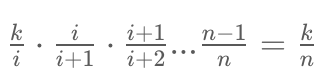

## Array traverse

### track min/max or both as we go, O(N^2) - > O(N)

1. [1026. Maximum Difference Between Node and Ancestor -- Medium](https://leetcode.com/problems/maximum-difference-between-node-and-ancestor/)

## Palindrome

1. [Valid Palindrome II -- Easy](https://leetcode.com/problems/valid-palindrome-ii/), if can make the string palindromic by at most delete one letter
2. [Valid Palindrome III -- Hard](https://leetcode.com/problems/valid-palindrome-iii/submissions/), define dp as least deletion to make the string palindromic 
3. [Palindromic Substring -- Medium](https://leetcode.com/problems/palindromic-substrings/) how many palindromic substring
4. [Longest Palindromic Substring -- Medium](https://leetcode.com/problems/longest-palindromic-substring/)
5. [Longest Palindromic Sequence -- Medium](https://leetcode.com/problems/longest-palindromic-subsequence/)
6. [Longest Palindromic Sequence II -- Medium](https://leetcode.com/problems/longest-palindromic-subsequence-ii/) even length, two consecutive characters not equal.
7. [564. Find the Closest Palindrome --  Hard](https://leetcode.com/problems/find-the-closest-palindrome/)
7. [1332. Remove Palindromic Subsequences -- Easy](https://leetcode.com/problems/remove-palindromic-subsequences/)
7. [246. Strobogrammatic Number -- Easy](https://leetcode.com/problems/strobogrammatic-number/)
7. [247. Strobogrammatic Number II -- Medium](https://leetcode.com/problems/strobogrammatic-number-ii/)
7. [248. Strobogrammatic Number III -- Hard](https://leetcode.com/problems/strobogrammatic-number-iii/)
7. [730. Count Different Palindromic Subsequences](https://leetcode.com/problems/count-different-palindromic-subsequences/)

## Parenthesis

### rule:

+ valid parenthesis has two patterns : `( ( ) )` and `( ) ( )`,
+ `countLeft >= countRight`
+ Usually can be solved by **DP**

```java
if(s[i] == s[j]) dp[i][j] = dp[i + 1][j - 1];
// or
for(int k = i; k < j; k++){
    if(dp[i][k] && dp[k + 1][j]){
        dp[i][j] = true;
        break;
    }
}
```

1. [678. Valid Parenthesis String -- Medium](https://leetcode.com/problems/valid-parenthesis-string/)
1. [2116. Check if a Parentheses String Can Be Valid -- Medium](https://leetcode.com/problems/check-if-a-parentheses-string-can-be-valid/)
2. [1963. Minimum Number of Swaps to Make the String Balanced -- Medium](https://leetcode.com/contest/weekly-contest-253/problems/minimum-number-of-swaps-to-make-the-string-balanced/) observe first couple of examples ( n = 1, n = 2, n = 3, ...) to find out the pattern

## Longest ?? Subarray/Subsequence

1. [300. Longest Increasing Subsequence --  Medium](https://leetcode.com/problems/longest-increasing-subsequence/) DP for sure, but **<u>Greedy + Binary Search</u>** is much faster
1. [646. Maximum Length of Pair Chain -- Medium](https://leetcode.com/problems/maximum-length-of-pair-chain/)
2. [1964. Find the Longest Valid Obstacle Course at Each Position -- Hard](https://leetcode.com/problems/find-the-longest-valid-obstacle-course-at-each-position)
3. [521. Longest Uncommon Subsequence I -- Hard](https://leetcode.com/problems/longest-uncommon-subsequence-i)
4. [522. Longest Uncommon Subsequence II -- Medium](https://leetcode.com/problems/longest-uncommon-subsequence-ii)


## Reverse

1. [189. Rotate Array -- Medium](https://leetcode.com/problems/rotate-array/) O(1) space

## Remove duplicates in sorted array template

```java
private int removeKDuplicates(int[] nums, int k){
        int i = 1, j = 1, count = 1;
        for(; j < nums.length; j++){
            if(nums[j] == nums[j - 1]){
                count++;
            }else{
                count = 1;
            }
            if(count <= k){
                nums[i++] = nums[j];
            }
        }
        return i;
    }
```

1. [26. Remove Duplicates from Sorted Array -- Easy](https://leetcode.com/problems/remove-duplicates-from-sorted-array/)
2. [80. Remove Duplicates from Sorted Array II -- Medium](https://leetcode.com/problems/remove-duplicates-from-sorted-array-ii/)

for linkedList, use `cur.val == cur.next.val`

1. [83. Remove Duplicates from Sorted List -- Easy](https://leetcode.com/problems/remove-duplicates-from-sorted-list/)
2. [82. Remove Duplicates from Sorted List II -- Medium](https://leetcode.com/problems/remove-duplicates-from-sorted-list-ii/)

## Trap Rain

1. [Trapping Rain Water -- Hard](https://leetcode.com/problems/trapping-rain-water/)
2. [11. Container With Most Water -- Medium](https://leetcode.com/problems/container-with-most-water/)


## HashMap + Double LinkedList

1. [460. LFU Cache -- Hard](https://leetcode.com/problems/lfu-cache/)
2. [432. All O`one Data Structure -- Hard](https://leetcode.com/problems/all-oone-data-structure/)
3. [146. LRU Cache --  Hard](https://leetcode.com/problems/lru-cache/)
3. [895. Maximum Frequency Stack -- Hard](https://leetcode.com/problems/maximum-frequency-stack/)

## find kth frequent/smallest/largest

**quick sort/select**

1. [347. Top K Frequent Elements -- Medium](https://leetcode.com/problems/top-k-frequent-elements/)
2. [272. Closest Binary Search Tree Value II --  Hard](https://leetcode.com/problems/closest-binary-search-tree-value-ii/)

## look from/at the left side and right side

1. [926. Flip String to Monotone Increasing -- Medium](https://leetcode.com/explore/item/3876)
2. [135. Candy -- Hard](https://leetcode.com/problems/candy)
3. [238. Product of Array Except Self -- Medium](https://leetcode.com/problems/product-of-array-except-self/)
4. [239. Sliding Window Maximum -- Hard](https://leetcode.com/problems/sliding-window-maximum)
5. [821. Shortest Distance to a Character --  Easy](https://leetcode.com/problems/shortest-distance-to-a-character/)
6. [1477. Find Two Non-overlapping Sub-arrays Each With Target Sum -- Medium](https://leetcode.com/problems/find-two-non-overlapping-sub-arrays-each-with-target-sum/)
7. [769. Max Chunks To Make Sorted -- Medium](https://leetcode.com/problems/max-chunks-to-make-sorted/)
8. [1402. Reducing Dishes -- Hard](https://leetcode.com/problems/reducing-dishes/)
9. [1395. Count Number of Teams -- Medium](https://leetcode.com/problems/count-number-of-teams/)
10. [2055. Plates Between Candles -- Medium](https://leetcode.com/problems/plates-between-candles/)
11. [689. Maximum Sum of 3 Non-Overlapping Subarrays -- Hard](https://leetcode.com/problems/maximum-sum-of-3-non-overlapping-subarrays/)
12. [2033. Minimum Operations to Make a Uni-Value Grid -- Medium](https://leetcode.com/problems/minimum-operations-to-make-a-uni-value-grid/)

## Shortest Path (BFS or binary BFS)

1. [127. Word Ladder -- Hard](https://leetcode.com/problems/word-ladder/)
2. [126. Word Ladder II -- Hard](https://leetcode.com/problems/word-ladder-ii/)

## Integer and Roman

1. [Roman to Integer -- Easy](https://leetcode.com/problems/roman-to-integer/) left Roman is always larger than right
2. [Integer to Roman -- Medium](https://leetcode.com/problems/integer-to-roman/) greedy, use possible largest Roman letter to run out  each digi


## Over lap / Intervals

See **Merge/Insert Intervals** section  in **Stack_Heap.md**


## Chess Queen

[51. N-Queens -- Hard](https://leetcode.com/problems/n-queens)

## Permutations in String

1. [Next Permutation -- Medium](https://leetcode.com/problems/next-permutation/) swap `nums[i]` with smallest larger number in `nums[i + 1, :]`
2. [1850. Minimum Adjacent Swaps to Reach the Kth Smallest Number -- Medium](https://leetcode.com/problems/minimum-adjacent-swaps-to-reach-the-kth-smallest-number/)

## Two Sum/Three Sum/4Sum

see section **Start at different position** -> **Given target, find equal/smaller/larger** @ **Two_pointers_Sliding_windows.md**

## Matrix

See matrix.md


## Stone Games

see **Play game** section in **Dynamic Programming.md**


## Jump Game

see **Jump Game** section in **Dynamic Programming.md**

[1871. Jump Game VII -- Medium](https://leetcode.com/problems/jump-game-vii/) tricky way to avoid processing same position

## Soduku 

How to check repetition? use string such as **" 9 in row 1", "9 in col 1", "9 in block 1"**;

1. [37. Sudoku Solver -- Hard](https://leetcode.com/problems/sudoku-solver/)
2. [36. Valid Sudoku -- Medium](https://leetcode.com/problems/valid-sudoku/)


## Calculator

1. See **Grapg.md** -> **DFS** -> **Calculation** for Basic Calculation series
2. [43. Multiply Strings -- Medium](https://leetcode.com/problems/multiply-strings/)


## Serialize and Deserialize Binary Tree / N-ary Tree

1. [297. Serialize and Deserialize Binary Tree -- Hard](https://leetcode.com/problems/serialize-and-deserialize-binary-tree/)
2. [449. Serialize and Deserialize BST -- Medium](https://leetcode.com/problems/serialize-and-deserialize-bst/) preorder
3. [428. Serialize and Deserialize N-ary Tree -- Hard](https://leetcode.com/problems/serialize-and-deserialize-n-ary-tree/)


## Lowest Common Ancestor for Tree

1. [235. Lowest Common Ancestor of a Binary Search Tree --Easy](https://leetcode.com/problems/lowest-common-ancestor-of-a-binary-search-tree/)
2. [236. Lowest Common Ancestor of a Binary Tree -- Medium](https://leetcode.com/problems/lowest-common-ancestor-of-a-binary-tree/)
3. [1644. Lowest Common Ancestor of a Binary Tree II -- Medium](https://leetcode.com/problems/lowest-common-ancestor-of-a-binary-tree-ii/)
4. [1087. Brace Expansion](https://leetcode.com/problems/brace-expansion/)
5. [1096. Brace Expansion II](https://leetcode.com/problems/brace-expansion-ii/)
6. [282. Expression Add Operators -- Hard](https://leetcode.com/problems/expression-add-operators/)


## Look Binary tree from different angle

1.[314. Binary Tree Vertical Order Traversal -- Medium](https://leetcode.com/problems/binary-tree-vertical-order-traversal/)

## Tree related distance

1. [863. All Nodes Distance K in Binary Tree -- Medium](https://leetcode.com/problems/all-nodes-distance-k-in-binary-tree/) turn it into graph and BFS

## Avoid adjacent char same or K distance away between same char ( template)

use **Waiting List**

1. [767. Reorganize String -- Medium](https://leetcode.com/problems/reorganize-string/)

2. [358. Rearrange String k Distance Apart](https://leetcode.com/problems/rearrange-string-k-distance-apart/)

```java
 public String rearrangeString(String s, int k) {
        HashMap<Character, Integer> freq = new HashMap<>();
        char[] ca = s.toCharArray();
        for(char c : ca){
            freq.put(c, freq.getOrDefault(c, 0) + 1);
        }
        
        PriorityQueue<int[]> queue = new PriorityQueue<>((a, b) -> b[1] - a[1]);
        for(char key : freq.keySet()){
            int[] temp = new int[]{key - 'a', freq.get(key)};
            queue.offer(temp);
        }
        // waiting queue
        Queue<int[]> waitList = new LinkedList<>();
        StringBuilder sb = new StringBuilder();
        while(!queue.isEmpty()){
            int[] cur = queue.poll();
            sb.append((char)(cur[0] + 'a'));
            cur[1]--;
            waitList.offer(cur);
            if(waitList.size() < k) continue;
            int[] back = waitList.poll();
            if(back[1] > 0){
                queue.offer(back);
            }
        }
        return sb.length() == s.length() ? sb.toString() : "" ;
    }
```

## Dates and days different related

count from 1900

1. [1360. Number of Days Between Two Date -- Easy](https://leetcode.com/problems/number-of-days-between-two-dates/)
2. [1154. Day of the Year -- Easy](https://leetcode.com/problems/day-of-the-year/)


## Stack

<u>see "Stack_Heap.md"</u>

## Need to make index smaller than current index

1. [315. Count of Smaller Numbers After Self -- Hard](https://leetcode.com/problems/count-of-smaller-numbers-after-self/)
2. [493. Reverse Pairs -- Hard](https://leetcode.com/problems/reverse-pairs/)


## Vowels

1. [1220. Count Vowels Permutation -- Hard](https://leetcode.com/problems/count-vowels-permutation/)
2. [966. Vowel Spellchecker -- Hard](https://leetcode.com/problems/vowel-spellchecker/)


## Clone questions

1. [138. Copy List with Random Pointer -- Medium](https://leetcode.com/problems/copy-list-with-random-pointer/)


## Rolling Hash / Index mark/ cyclic indexing

1. [41. First Missing Positive -- Hard](https://leetcode.com/problems/first-missing-positive)
2. [448. Find All Numbers Disappeared in an Array -- Easy](https://leetcode.com/problems/find-all-numbers-disappeared-in-an-array/)
3. [442. Find All Duplicates in an Array -- Medium](https://leetcode.com/problems/find-all-duplicates-in-an-array/)
4. [565. Array Nesting -- Medium](https://leetcode.com/problems/array-nesting/)
4. [249. Group Shifted Strings -- Medium](https://leetcode.com/problems/group-shifted-strings)
6. [49. Group Anagrams -- Medium](https://leetcode.com/problems/group-anagrams/)
7. [1044. Longest Duplicate Substring --  Hard](https://leetcode.com/problems/longest-duplicate-substring/)
8. [1062. Longest Repeating Substring -- Hard](https://leetcode.com/problems/longest-duplicate-substring/)
8. [718. Maximum Length of Repeated Subarray -- Medium](https://leetcode.com/problems/maximum-length-of-repeated-subarray/)
8. [370. Range Addition -- Hard](https://leetcode.com/problems/range-addition/)
8. [1392. Longest Happy Prefix -- Hard](https://leetcode.com/problems/longest-happy-prefix/)


## Merge Intervals

1. [56. Merge Intervals -- Medium](https://leetcode.com/problems/merge-intervals)
2. [57. Insert Interval -- Medium](https://leetcode.com/problems/insert-interval)
3. [253. Meeting Rooms II -- Medium](https://leetcode.com/problems/meeting-rooms-ii)
3. [729. My Calendar I -- Medium](https://leetcode.com/problems/my-calendar-i/)
3. [731. My Calendar II -- Medium](https://leetcode.com/problems/my-calendar-ii/)


## Majority of numbers in an array (Moore Voting Algorithm)

1. [169. Majority Element -- Easy](https://leetcode.com/problems/majority-element/)
2. [229. Majority Element II -- Medium](https://leetcode.com/problems/majority-element-ii) need to verify if it is not guaranteed to have such numbers 


## Range caching

1. [370. Range Addition -- Medium](https://leetcode.com/problems/range-addition)
2. [598. Range Addition II -- Easy](https://leetcode.com/problems/range-addition-ii)
2. [1109. Corporate Flight Bookings -- Medium](https://leetcode.com/problems/corporate-flight-bookings/)
2. [2021. Brightest Position on Street --  Medium](https://leetcode.com/problems/brightest-position-on-street/)
2. [1094. Car Pooling -- Medium](https://leetcode.com/problems/car-pooling/)


## Do it until we can not

[871. Minimum Number of Refueling Stops -- Hard](https://leetcode.com/problems/minimum-number-of-refueling-stops/)


## String/Array Manipulation

1. [777. Swap Adjacent in LR String -- Medium](https://leetcode.com/problems/swap-adjacent-in-lr-string/)

2. [1574. Shortest Subarray to be Removed to Make Array Sorted  -- Medium](https://leetcode.com/problems/shortest-subarray-to-be-removed-to-make-array-sorted/)


## Digit Permutation

1. [902. Numbers At Most N Given Digit Set -- Hard](https://leetcode.com/problems/numbers-at-most-n-given-digit-set/)
1. [233. Number of Digit One -- Hard](https://leetcode.com/problems/number-of-digit-one/)


## Brute force first N examples to find rules

1. [330. Patching Array -- Hard](https://leetcode.com/problems/patching-array/)
1. [400. Nth Digit -- Medium](https://leetcode.com/problems/nth-digit/)


## Reservoir Sampling

https://www.youtube.com/watch?v=aMhe_Riny5E&t=46s

From N elements, uniformly randomly pick up K elements, to make possibility k/n. N would be super large to be written into the memory or we do not know the size.

for example, number stream, the number keeps coming in, and we cannot record total number of numbers, how do we pick up k numbers as we go?

say given a[i], in order to place it in the reservoir, first of all we need to pick it up when a[i] is coming in, which is `k/i`, why? 

There are `C(i, 1)` combinations of picking up 1 element from i element, and there are `C(k, 1)` to pick up one cell in the reservoir for the picked element to sit.

Then we have to make sure in the later on pick, this element is not selected which is ` j - 1/j`.which meams always pick rest of numbers `1 - 1/j`, for example, `i = i + 1`,  and a[i] is alreayd inside the reservior, then for i + 1 elements, the possibility of not picking up a[i] is `i/i+1` ...make a[[]]



[code](https://leetcode.com/playground/iLvsu6uv)

1. [382. Linked List Random Node -- Medium](https://leetcode.com/problems/linked-list-random-node/)
2. [398. Random Pick Index -- Medium](https://leetcode.com/problems/random-pick-index/)

## Multiple factors need to consider

1. [1029. Two City Scheduling -- Medium](https://leetcode.com/problems/two-city-scheduling/)
2. [1366. Rank Teams by Votes -- Medium](https://leetcode.com/problems/rank-teams-by-votes/)
3. [1383. Maximum Performance of a Team -- Hard](https://leetcode.com/problems/maximum-performance-of-a-team/)
4. [354. Russian Doll Envelopes -- Hard](https://leetcode.com/problems/russian-doll-envelopes/)
5. [1996. The Number of Weak Characters in the Game -- Medium](https://leetcode.com/problems/the-number-of-weak-characters-in-the-game/)


## Find part and check if rest exist

1. [939. Minimum Area Rectangle -- Medium](https://leetcode.com/problems/minimum-area-rectangle/)


### Expand (when see min or max)

1. [907. Sum of Subarray Minimums -- Medium](https://leetcode.com/problems/sum-of-subarray-minimums/)
1. **[2104. Sum of Subarray Ranges -- Medium](https://leetcode.com/problems/sum-of-subarray-ranges/)** `sumMax - sumMin`
1. [1248. Count Number of Nice Subarrays -- Medium](https://leetcode.com/problems/count-number-of-nice-subarrays/)
1. [891. Sum of Subsequence Widths -- Hard](https://leetcode.com/problems/sum-of-subsequence-widths/)
1. [1498. Number of Subsequences That Satisfy the Given Sum Condition -- Medium](https://leetcode.com/problems/number-of-subsequences-that-satisfy-the-given-sum-condition/)


## Find Missing Numbers

1. [268. Missing Number -- Easy](https://leetcode.com/problems/missing-number)

## Use comparator directly 

check **Sorting.md** -> **Use comparator directly **


## Time clock relate

1. [539. Minimum Time Difference -- Medium](https://leetcode.com/problems/minimum-time-difference)


## Next letter pointer

1. [792. Number of Matching Subsequences -- Medium](https://leetcode.com/problems/number-of-matching-subsequences/)

## Track row/col/dia/anitDia

1. [1001. Grid Illumination -- Hard](https://leetcode.com/problems/grid-illumination/)
2. [51. N-Queens -- Hard](https://leetcode.com/problems/n-queens)

## find colinear points

fix one point, connect rest of points to the fixed point, track slopes by hashmap, `{slope: List of points}`

1. [149. Max Points on a Line -- Hard](https://leetcode.com/problems/max-points-on-a-line/) save slope as fraction instead of double value


## Backward

1. [991. Broken Calculator -- Medium](https://leetcode.com/problems/broken-calculator/)


## Math

#### GCD

1. [365. Water and Jug Problem -- Medium](https://leetcode.com/problems/water-and-jug-problem/)
1. [149. Max Points on a Line -- Hard](https://leetcode.com/problems/max-points-on-a-line/) save slope as fraction instead of double value

### Shape

+ to form rectangle:

  + If sides are parrallel with x or y axis, then pick one diagonal, check another diagonal

  + If sides are parrallel with x or y axis is not guaranteed, 

    + point a and b form a line, point b and c to form rectangle, line (b, c) and line(a, b) share same mid points and same length

    + Line(a, b) and line(c,d) are parallel and same length, and also perpendicular `x1 * x2 + y1 * y2 = 0`

1. [939. Minimum Area Rectangle --  Medium](https://leetcode.com/problems/minimum-area-rectangle)
2. [963. Minimum Area Rectangle II -- Medium](https://leetcode.com/problems/minimum-area-rectangle-ii)
3. [223. Rectangle Area --  Medium](https://leetcode.com/problems/rectangle-area)

#### other

1. [1954. Minimum Garden Perimeter to Collect Enough Apple -- Medium](https://leetcode.com/problems/minimum-garden-perimeter-to-collect-enough-apples/)
1. [829. Consecutive Numbers Sum -- Hard](https://leetcode.com/problems/consecutive-numbers-sum/)
