1. [370. Range Addition](https://leetcode.com/problems/range-addition)

2. [find good camping days](https://leetcode.com/discuss/interview-question/algorithms/1520406/Amazon-OA-count-the-outing-days/1120226)

    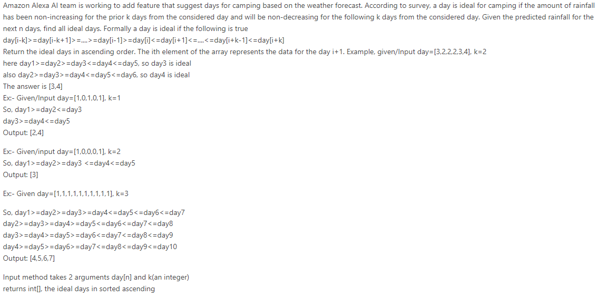

3. armor Game (first blood)

    

4. min stock price difference

    

5. [group movie](https://leetcode.com/discuss/interview-question/1735633/Amazon-OA-2022/1246722)

    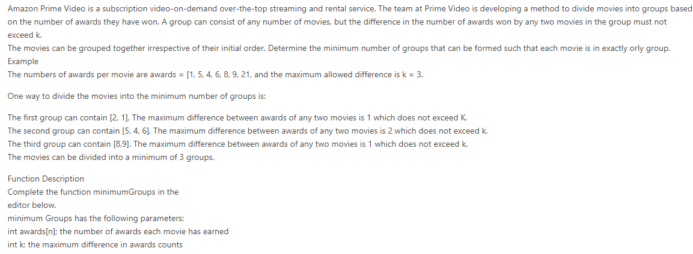

6. pascal encoding 

    

    

7. Maximum Quality, packets and channel

    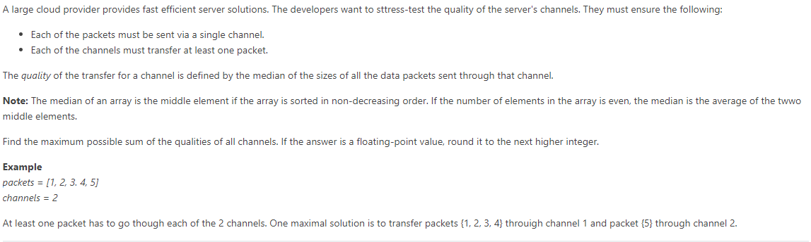

8. [828. Count Unique Characters of All Substrings of a Given String](https://leetcode.com/problems/count-unique-characters-of-all-substrings-of-a-given-string)

9. [count decreasing ratings](https://leetcode.com/discuss/interview-question/1554594/amazon-oa-oct-2021-sde2)

    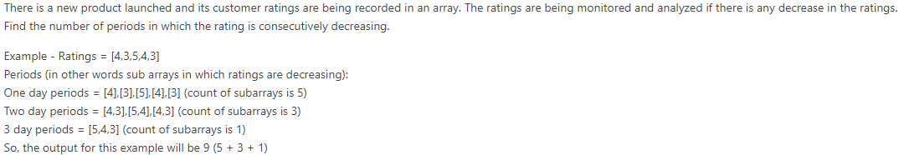

10. [min swap to group 1s and 0s](https://leetcode.com/discuss/interview-question/1554594/amazon-oa-oct-2021-sde2)

    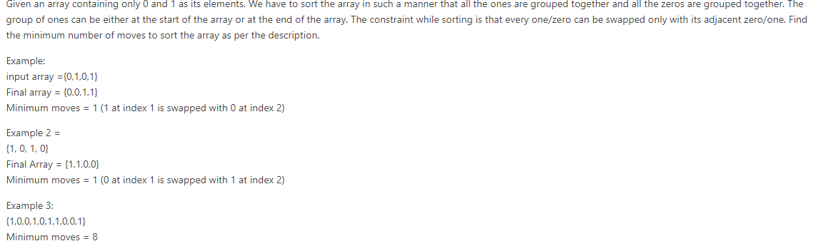

11. ##### Max deviation among all substrings ??? [link](https://leetcode.com/discuss/interview-question/1742621/Amazon-or-OA-or-Max-deviation-among-all-substrings)

      1. https://www.1point3acres.com/bbs/thread-856338-1-1.html
      1. https://leetcode.com/discuss/interview-question/1742621/Amazon-or-OA-or-Max-dev&amp;#8205;&amp;#8204;&amp;#8205;&amp;#8204;&amp;#8204;&amp;#8205;&amp;#8205;&amp;#8204;&amp;#8205;&amp;#8205;&amp;#8204;&amp;#8205;&amp;#8205;&amp;#8205;&amp;#8204;&amp;#8204;&amp;#8205;&amp;#8205;&amp;#8204;iation-among-all-substrings

12. ##### Max Length of Valid Server Cluster [link](https://www.1point3acres.com/bbs/thread-856589-1-1.html)

13. subarray imbalance **????** [link](https://www.1point3acres.com/bbs/thread-856918-1-1.html)

     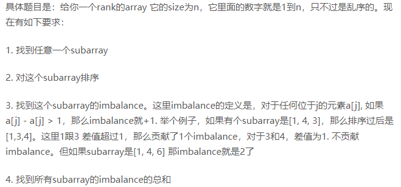

14. shipment sum(max) - sum(min)

     Amazon logistics has multiple delivery centers from which products are sent.

     In one such delivery center, parcels are placed in a sequence where the i-th parcel has a weight of weight[i]. A shipment is constituted of a contiguous segment of parcels. The shipment imbalance of a shipment is defined as the difference between the max and min weights within a shipment.

     Given the arrangement of parcels, find the sum of shipment imbalance of all the shipments that can be formed from the given sequence of parcels.

     #### Example 1:

     **Input**:

     ```
     1weights = [1, 3, 2]
     ```

     **Output**: `5`

     **Explanation**:

     The shipment imbalance calculations for each possible shipment are shown below.

     | Shipments     | Max Weight | Min Weight | Imbalance |
     | ------------- | ---------- | ---------- | --------- |
     | ***1*** ,3, 2 | 1          | 1          | 1-1=0     |
     | 1, ***3***, 2 | 3          | 3          | 3-3=0     |
     | 1, 3, ***2*** | 2          | 2          | 2-2=0     |
     | ***1, 3***, 2 | 3          | 1          | 3-1=2     |
     | 1, ***3, 2*** | 3          | 2          | 3-2=1     |
     | ***1, 3, 2*** | 3          | 1          | 3-1=2     |

15. [灰度](https://www.1point3acres.com/bbs/thread-842588-1-1.html)**？？？？**

16. given array, move prime to the left and no-prime to the right

17. given a integer, remove one 5 to get max

18. [partition parenthese array](https://leetcode.com/discuss/interview-question/1332412/amazon-online-assessment-question)

      

19. ##### [K best combo / Find K maximum Priority](https://leetcode.com/discuss/interview-question/1625460/amazon-oa-find-k-maximum-priority)

     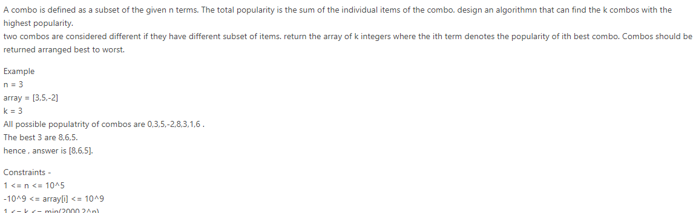

20. [739. Daily Temperatures](https://leetcode.com/problems/daily-temperatures)

21. aggregate temperature

      

22. parcels and trucks

      

23. [926. Flip String to Monotone Increasing](https://leetcode.com/problems/flip-string-to-monotone-increasing)

24. giving a string with parentheses, return the string after removing the invalid parentheses.   a)bc(de))f -> abc(de)f

25. [527. Word Abbreviation](https://leetcode.com/problems/word-abbreviation)

26. kindle page mark (three pages)

      

28. [547. Number of Provinces](https://leetcode.com/problems/number-of-provinces)

29. [680. Valid Palindrome II](https://leetcode.com/problems/valid-palindrome-ii/)

30. [1268. Search Suggestions System](https://leetcode.com/problems/search-suggestions-system)

30. discounted prices

     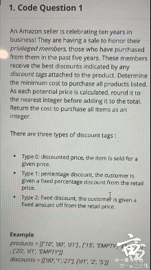

     The product array element are in the form ['price', 'tag1', 'tag2'.....tagm-1.] There maybe zero or more discount codes associated with the product.Discount tags in product array maybe 'EMPTY' which is the same as NULL value.The Discount Array elements are in form['tag', 'type', 'amount']

     If a privileged member buys product 1 listed at a price of 10 with two discount available:

     Under discount d0 of type 1 , the discounted price is 10- 10*0.27 = 7.30, round 7. Under discount of d1 of type 2, the discounted price price is 10-5 = 5

     The price to purchase the product :

     1 is the lowest of the two, or 5 in this case.

     The second product is priced at 15 because there are no discounts available

     The third product is priced at 20 .Using discount tag d1 of type 2, the discount price is 20-5 = 15

     the total price to purchase the three item is 5+15+15 = 35.

     *NOTES: Not all items will have the Maximum number of tags. Empty tags may just not exist in input or they maybe filled with the string Empty.These are equivalent as demonstrated in the example above*

     

     **FUNCTION DESCRIPTION**

     

     Complete the function. Find *LowestPrice* in the editor below.

     

     [string] products[n][m]: a 2D array of product descriptors as strings:price followed up by up to m-1 discount tags.
     [string] discounts[3] : a 2D array of tag descriptors as string: tag, type amount. int: the total amount paid in for all listed products , discounts to privileged members pricing.

     **Constraints** 1<n, m ,d<1000 // meant less or equal to.

31. Max segment profit

     https://leetcode.com/discuss/interview-question/1321204/efficient-harvest-faang-oa-question-2021

     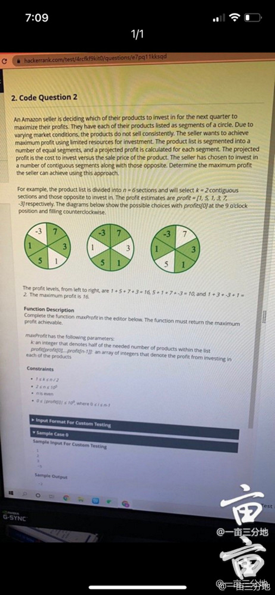

32. merge package to get the heaviest package

     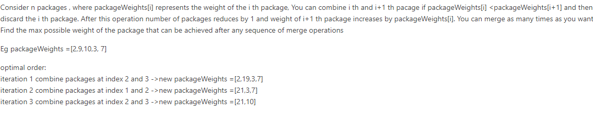

33. Routers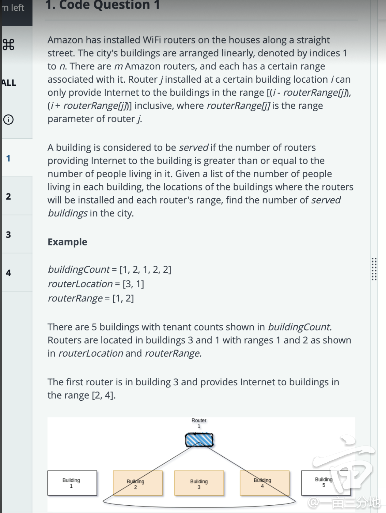

34. Minimize Memory

      given array indicates memory used for each process, try to delete a contiguous segment of process to minimize the total memory: e.g. [10,4,8,1], k = 2; delete [10, 4], min memory is 9

35. find password strength

     Find the password strength.
     For each substring of the password which contains at least one vowel and one consonant, its strength goes up by 1.
     vowels={'a', 'e', 'i', 'o', 'u'}, and rest of letters are all consonant.
     (Only lower alphabet letters)

     ```
     Input:
     thisisbeautiful
     output:
     6
     explaination:
     this, is, be, aut, if, ul
     
     input:
     hackerrank
     output:
     3
     explaination:
     hack, er, rank
     
     input:
     aeiou
     output:
     0
     ```

36. [Sort Order](https://leetcode.com/discuss/interview-question/1261316/amazon-oa-sde-1-new-grad-2021-batch-india)

     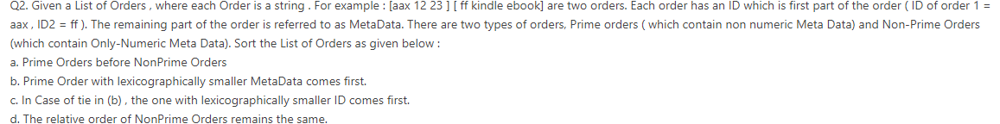

37. longest subarray has product 1

    given array in which elements are either 1 or -1, find the length of the longest subarray that has product as 1

38. Valid Groupon

    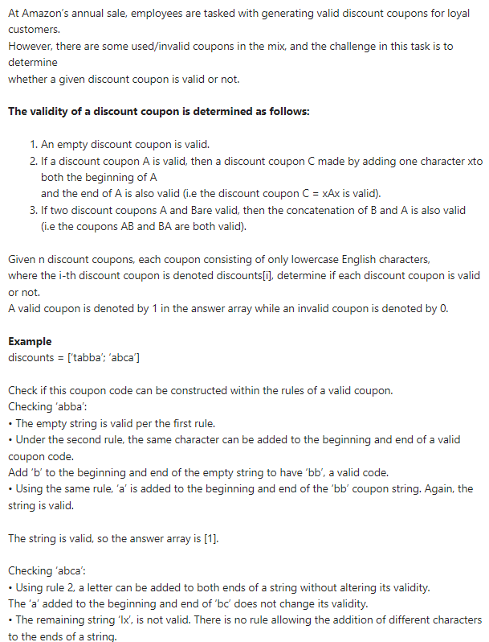

39. pick songs

    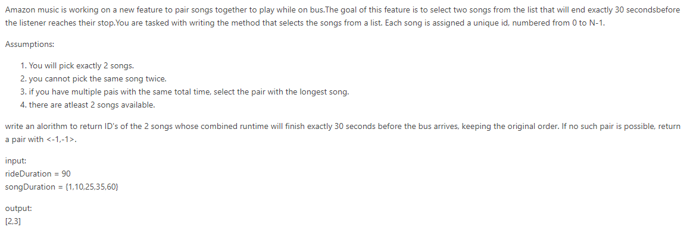

40. **count power for services???**

    1. https://leetcode.com/discuss/interview-question/1741735/amazon-hackerrank-oa-sde-2-february-2022

    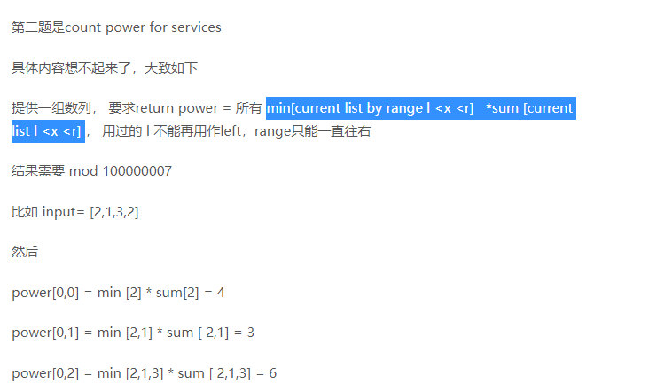