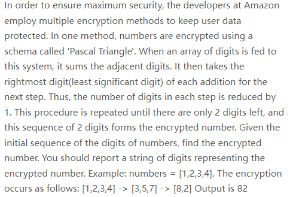
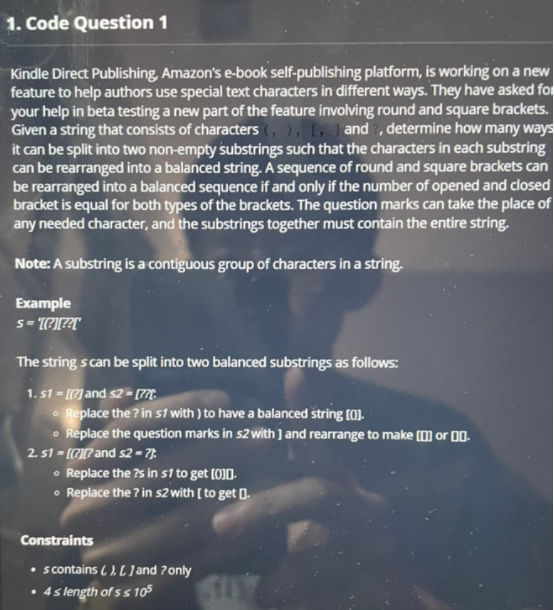
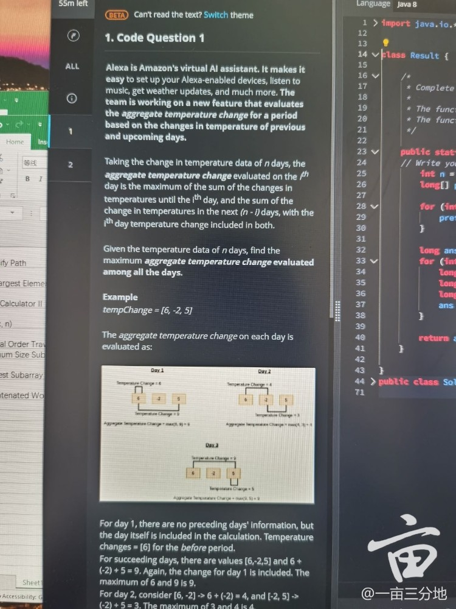
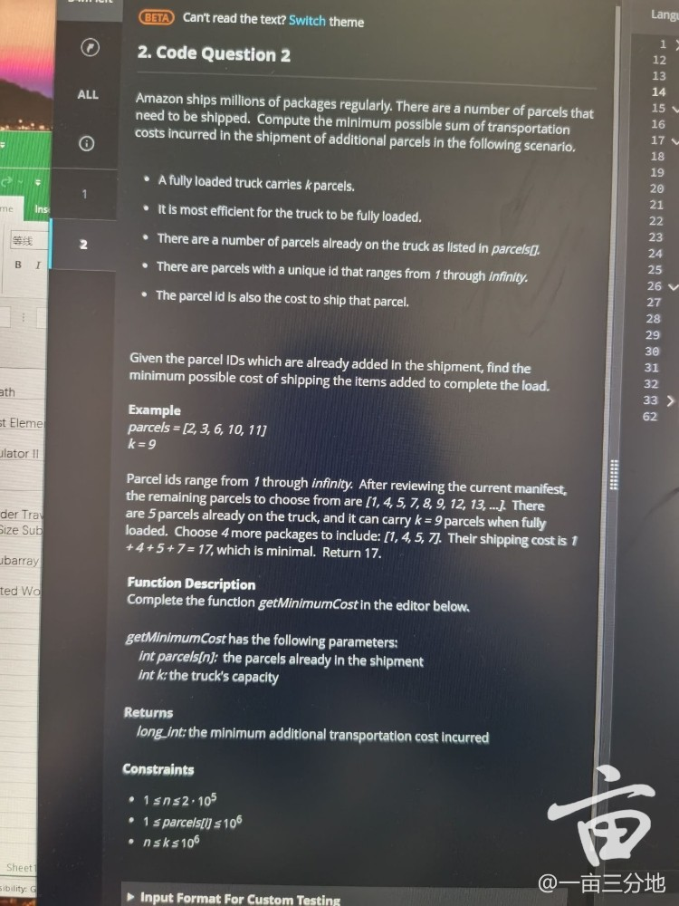
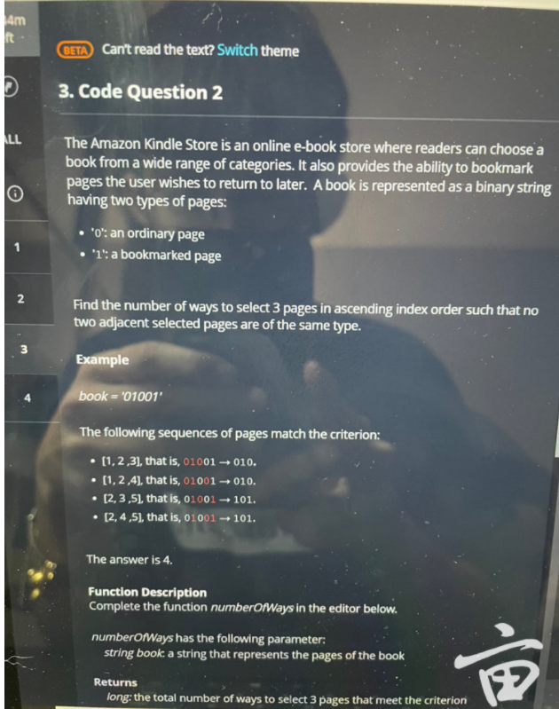

1. unknown

    

2. [370. Range Addition](https://leetcode.com/problems/range-addition)

3. find good camping days

4. armor Game (first blood)

5. min stock price difference

5. [group movie](https://leetcode.com/discuss/interview-question/1735633/Amazon-OA-2022/1246722)

6. unknown **???**

    

    

7. Maximum Quality, packets and channel **???**

    You are given a list of packets of varying sizes and there are `n` channels.

    

    - Each of the `n` channel must have a single packet
    - Each packet can only be on a single channel

    

    The quality of a channel is described as the `median` of the packet sizes on that channel. The total quality is defined as sum of the quality of all channels (round to integer in case of float). Given the `packets []int32` and `channels int32` find the maximum quality.

    **Example 1:**

    

    ```
    packets := []int32{1, 2, 3, 4, 5}
    channels := 2
    
    // Explaination: If packet {1, 2, 3, 4} is sent to channel 1, the median of that channel would be 2.5.
    //               If packet {5} is sent to channel 2 its median would be 5. 
    //               Total quality would be 2.5 + 5 = 7.5 ~ 8
    answer := 8
    ```

    

    **Example 2:**

    

    ```
    packets := []int32{5, 2, 2, 1, 5, 3}
    channels := 2
    
    // Explaination: Channel 1: {2, 2, 1, 3} (median: 2)
    //               Channel 2: {5, 5}       (median: 5)
    //               Total Quality : 2 + 5 = 7
    
    // Explaination 2: Channel 1: {5, 2, 2, 1, 3} (median: 2)
    //                 Channel 2: {5}             (median: 5)
    //                 Total Quality : 2 + 5 = 7
    answer := 7
    ```

9. [828. Count Unique Characters of All Substrings of a Given String](https://leetcode.com/problems/count-unique-characters-of-all-substrings-of-a-given-string)

10. decreasing ratings

10. min swap to group 1s and 0s

12. ##### Max deviation among all substrings ??? [link](https://leetcode.com/discuss/interview-question/1742621/Amazon-or-OA-or-Max-deviation-among-all-substrings)

     1. https://www.1point3acres.com/bbs/thread-856338-1-1.html

13. ##### Max Length of Valid Server Cluster [link](https://www.1point3acres.com/bbs/thread-856589-1-1.html)

14. subarray imbalance **????** [link](https://www.1point3acres.com/bbs/thread-856918-1-1.html)

15. shipment sum(max) - sum(min)

16. [灰度](https://www.1point3acres.com/bbs/thread-842588-1-1.html)**？？？？**

17. given array, move prime to the left and no-prime to the right

18. given a integer, remove one 5 to get max

19. [partition parenthese array](https://leetcode.com/discuss/interview-question/1332412/amazon-online-assessment-question) ???

     

20. ##### [Find K maximum Priority](https://leetcode.com/discuss/interview-question/1625460/amazon-oa-find-k-maximum-priority) ???

21. [739. Daily Temperatures](https://leetcode.com/problems/daily-temperatures)

22. aggregate temperature

     

23. parcels and trucks

     

24. [926. Flip String to Monotone Increasing](https://leetcode.com/problems/flip-string-to-monotone-increasing)

25. giving a string with parentheses, return the string after removing the invalid parentheses.   a)bc(de))f -> abc(de)f

26. [527. Word Abbreviation](https://leetcode.com/problems/word-abbreviation)

27. kindle page mark (three pages)

     