1. [370. Range Addition](https://leetcode.com/problems/range-addition)

2. **[find good camping days](https://leetcode.com/discuss/interview-question/algorithms/1520406/Amazon-OA-count-the-outing-days/1120226)**

    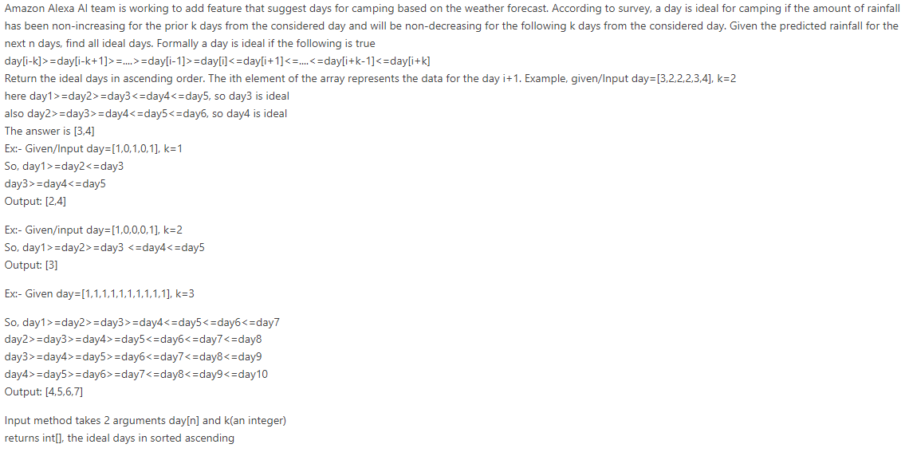

3. **armor Game (first blood)**

    

4. **Min stock price Change**

    

5. **[group movie](https://leetcode.com/discuss/interview-question/1735633/Amazon-OA-2022/1246722)**

    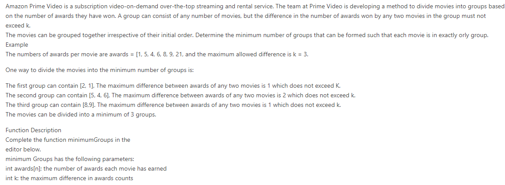

6. **pascal encoding** 

    

    

7. **Max Quality, packets and channel**

    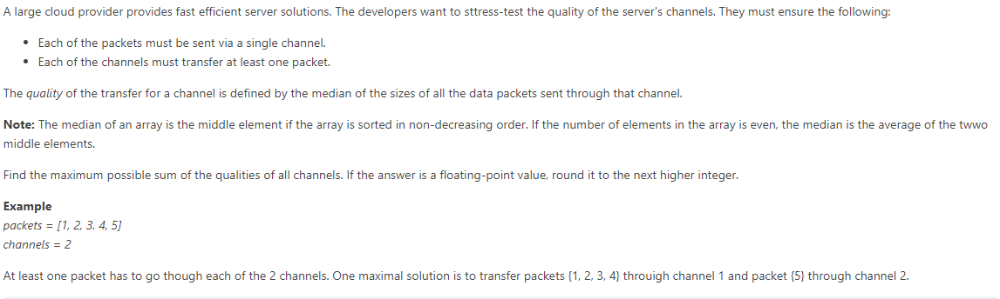

8. [828. Count Unique Characters of All Substrings of a Given String](https://leetcode.com/problems/count-unique-characters-of-all-substrings-of-a-given-string)

9. [count decreasing ratings](https://leetcode.com/discuss/interview-question/1554594/amazon-oa-oct-2021-sde2)

    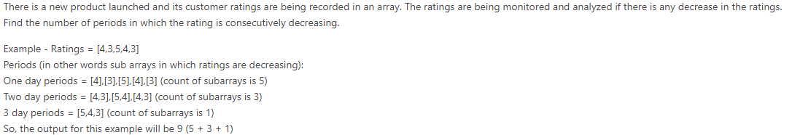

10. **[min swap to group 1s and 0s](https://leetcode.com/discuss/interview-question/1554594/amazon-oa-oct-2021-sde2)**

    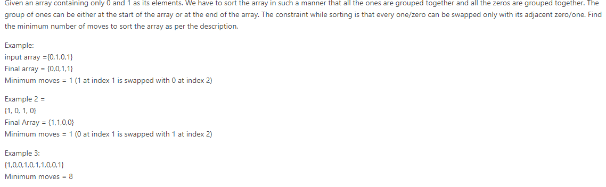

11. ##### Max deviation among all substrings [link](https://leetcode.com/discuss/interview-question/1742621/Amazon-or-OA-or-Max-deviation-among-all-substrings)

12. ##### Max Length of Valid Server Cluster [link](https://www.1point3acres.com/bbs/thread-856589-1-1.html)

     Given `int[] bootingPower, int[] processingPower, int powerMax`, find length of the longest consecutive subarray `[i : j]` such that the `max(bootingPower[i : j]) + sum(processingPower[i : j]) * (j - i + 1)` does not exceed `powerMax`

13. **Rank imbalance / subarray imbalance** **????** [link](https://www.1point3acres.com/bbs/thread-856918-1-1.html)

     https://leetcode.com/discuss/interview-question/1741735/amazon-hackerrank-oa-sde-2-february-2022

      

     

     https://leetcode.com/discuss/interview-question/1802061/Amazon-SDE2-OA

     https://leetcode.com/playground/eWkHLSGD

14. **shipment sum(max) - sum(min)** 

     Amazon logistics has multiple delivery centers from which products are sent.

     In one such delivery center, parcels are placed in a sequence where the i-th parcel has a weight of weight[i]. A shipment is constituted of a contiguous segment of parcels. The shipment imbalance of a shipment is defined as the difference between the max and min weights within a shipment.

     Given the arrangement of parcels, find the sum of shipment imbalance of all the shipments that can be formed from the given sequence of parcels.

     #### Example 1:

     **Input**:

     ```
     1weights = [1, 3, 2]
     ```

     **Output**: `5`

     **Explanation**:

     The shipment imbalance calculations for each possible shipment are shown below.

     | Shipments     | Max Weight | Min Weight | Imbalance |
     | ------------- | ---------- | ---------- | --------- |
     | ***1*** ,3, 2 | 1          | 1          | 1-1=0     |
     | 1, ***3***, 2 | 3          | 3          | 3-3=0     |
     | 1, 3, ***2*** | 2          | 2          | 2-2=0     |
     | ***1, 3***, 2 | 3          | 1          | 3-1=2     |
     | 1, ***3, 2*** | 3          | 2          | 3-2=1     |
     | ***1, 3, 2*** | 3          | 1          | 3-1=2     |

15. **[gray scale](https://www.1point3acres.com/bbs/thread-842588-1-1.html)**

     Gray Scale Given a 2D array only including value 0, 1, the gray scale of a cell [i,j] is `sum(ith row) + sum(jth col)`, find the the cell with max gray scale;

16. **given array, move prime to the left and no-prime to the right**

17. **given a integer, remove one 5 to get max**

18. **[partition parenthese array](https://leetcode.com/discuss/interview-question/1332412/amazon-online-assessment-question)**

      

19. ##### [K best combo / Find K maximum Priority](https://leetcode.com/discuss/interview-question/1625460/amazon-oa-find-k-maximum-priority)

    ##### 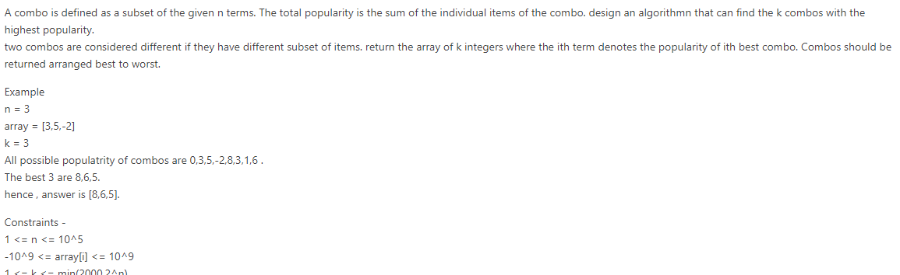

20. [739. Daily Temperatures](https://leetcode.com/problems/daily-temperatures)

21. **aggregate temperature**

      

22. **parcels and trucks**

      

23. [926. Flip String to Monotone Increasing](https://leetcode.com/problems/flip-string-to-monotone-increasing)

24. **Remove invalid parentheses**

     giving a string with parentheses, return the string after removing the invalid parentheses.   a)bc(de))f -> abc(de)f

25. [527. Word Abbreviation](https://leetcode.com/problems/word-abbreviation)

26. **kindle page mark**

      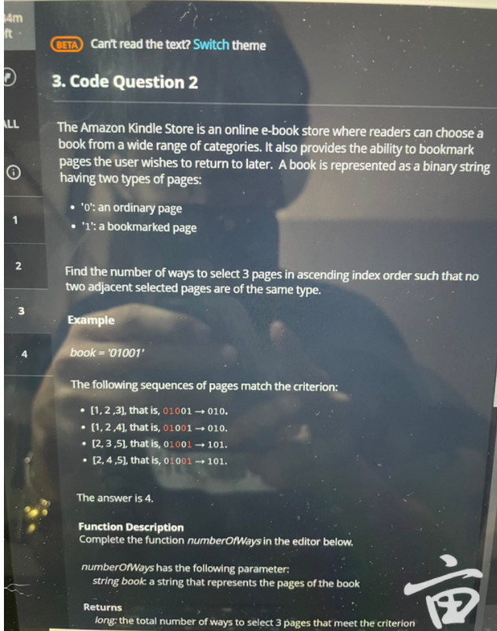

28. [547. Number of Provinces](https://leetcode.com/problems/number-of-provinces)

29. [680. Valid Palindrome II](https://leetcode.com/problems/valid-palindrome-ii/)

30. [1268. Search Suggestions System](https://leetcode.com/problems/search-suggestions-system)

30. **discounted prices**

    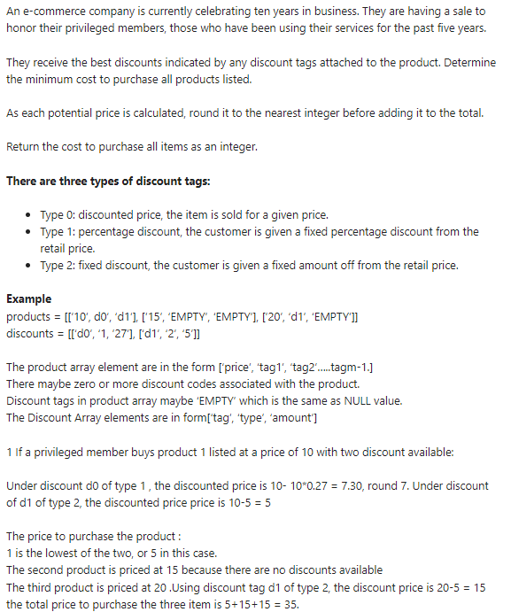

     The product array element are in the form ['price', 'tag1', 'tag2'.....tagm-1.] There maybe zero or more discount codes associated with the product.Discount tags in product array maybe 'EMPTY' which is the same as NULL value.The Discount Array elements are in form['tag', 'type', 'amount']

     If a privileged member buys product 1 listed at a price of 10 with two discount available:

     Under discount d0 of type 1 , the discounted price is 10- 10*0.27 = 7.30, round 7. Under discount of d1 of type 2, the discounted price price is 10-5 = 5

     The price to purchase the product :

     1 is the lowest of the two, or 5 in this case.

     The second product is priced at 15 because there are no discounts available

     The third product is priced at 20 .Using discount tag d1 of type 2, the discount price is 20-5 = 15

     the total price to purchase the three item is 5+15+15 = 35.

     *NOTES: Not all items will have the Maximum number of tags. Empty tags may just not exist in input or they maybe filled with the string Empty.These are equivalent as demonstrated in the example above*

     

     **FUNCTION DESCRIPTION**

     

     Complete the function. Find *LowestPrice* in the editor below.

     

     [string] products[n][m]: a 2D array of product descriptors as strings:price followed up by up to m-1 discount tags.
     [string] discounts[3] : a 2D array of tag descriptors as string: tag, type amount. int: the total amount paid in for all listed products , discounts to privileged members pricing.

     **Constraints** 1<n, m ,d<1000 // meant less or equal to.

31. **Max segment profit**

     https://leetcode.com/discuss/interview-question/1321204/efficient-harvest-faang-oa-question-2021

     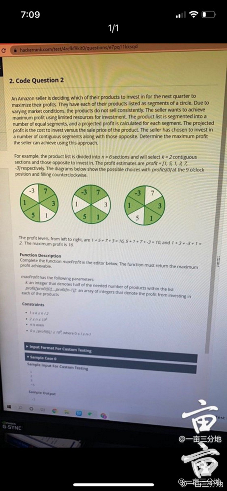

32. **merge package to get the heaviest package**

     

33. **wifi Routers cover buildings**

34. **Minimize Memory**

       given array indicates memory used for each process, try to delete a contiguous segment of process to minimize the total memory: e.g. [10,4,8,1], k = 2; delete [10, 4], min memory is 9

     

35. **find password strength**

     Find the password strength.
     For each substring of the password which contains at least one vowel and one consonant, its strength goes up by 1.
     vowels={'a', 'e', 'i', 'o', 'u'}, and rest of letters are all consonant.
     (Only lower alphabet letters)

     ```
     Input:
     thisisbeautiful
     output:
     6
     explaination:
     this, is, be, aut, if, ul
     
     input:
     hackerrank
     output:
     3
     explaination:
     hack, er, rank
     
     input:
     aeiou
     output:
     0
     ```

36. **[Sort Order](https://leetcode.com/discuss/interview-question/1261316/amazon-oa-sde-1-new-grad-2021-batch-india)**

     

37. **longest subarray has product 1**

    given array in which elements are either 1 or -1, find the length of the longest subarray that has product as 1

38. **Valid Groupon**

    

39. **pick songs**

    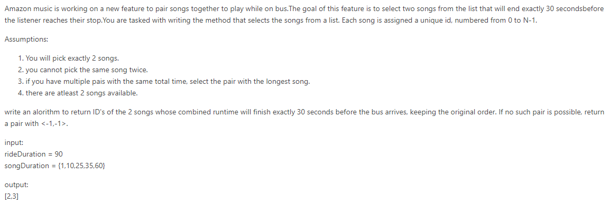

40. **count power for services???**

    

    ```c++
    *Question.
    **given an array A. For all subarrays of you have to find sum of sum(A[l:r])min(A[l:r]) for every subarray
    and return answer % 1e9+7;**
    constraint
    **1 <= len(A) <= 500000
    1 <= A[i] <= 1e5;**
    I am posting detialed solution to above problem asked by many. It will help many to understand how standard interview problems can be used to solve
    Hope this helps.
    
    **Its basically Leetcode hard problem (or harder side dont get demotivate by this problem see what you have learnt from this problem.**
    
    lets suppose array is A = [a1 a2 a3 a4 a5 a6 a7]
    
    we basically have to calculate for all subarrays sum(A[l:r])*min(A[l:r]) which basically means for every sum we have to take sum and multiply it by minimum element of that subarray.
    
    lets see another prespective of this problem we basically can do is for every element we will find sum of all subarrays in which that element is minimum. now comes the questions how to find that lets take example
    
    suppose for element a4 , a6 is next smaller element of a4, a6 that means first element after a4 that is smaller than a4.
    
    similarly we can define previous smaller element lets suppose a2 is the previous smaller element.
    
    i is index of a2 
    j is index of a6 
    k is index of a4
    [a1 a2 a3 a4 a5 a6 a7]
    
    we have to find sum of all subarrays that include A[k] from subarray of A[i+1:j-1]. because in all that subarray A[k] will be minimum (A[i] and A[j] are right and left closest element greater than a[k])
    
    Now to find the sum of all subarrays we need to think how we can compute that
    
    we can basically find the how many times a particular element occurs in all subarray then we can do element*howmanysubarrayitoccurs.
    
    lets see a3 how many times it will occur. as a3 is last index of subarray A[i+1:j-1];
    Occurence of a3 will be (j-k) as we have fixed our left pointer of subarray. h
    Occurence of a4 will be (j-k) + occurence of a3 (if we are choosing right pointer at a3 a4 is also the part of that subarray) which is 2*(k-j).
    
    From here we can say that
    A[i+1] will occur (j-k) times
    A[i+2] will occur 2*(j-k) times
    A[i+3] will occur 3*(j-k) times.
    So on.
    
    Similarly
    A[j-1] will occur (k-i) times
    A[j-2] will occur 2*(k-i) times.
    So on
    A[k] will occur (j-k)*(k-i) times (as there are j-k ways to choose right pointer k-i way for left pointer )
    So sum of all subarrays will be
    
    A[i+1](j-k) + 2(j-k)A[i+2]..........A[k](j-k)(k-i) + A[j-1](k-i) + A[j-2]*(k-i)*2
    
    adding and subtracting A[k](j-k)(k-1) expression will become
    
    A[i+1](j-k) + 2(j-k)A[i+2]..........A[k](j-k)(k-i) + A[j-1](k-i) + A[j-2](k-i)2....
    A[k](j-k)(k-i) - A[k](j-k)(k-i)
    
    (j-k)(A[i+1] + 2A[i+2] ..... (k-i)A[k]) + (k-i)(A[j-1] + 2A[j-2] ... A[k](j-k)) - A[k](j-k)) - A[k](j-k)*(k-i)
    
    if you observe A[i+1] + 2*A[i+2] ..... (k-i)*A[k] is basically SumSubarr[k:k] + sumSubarr[k-1:K] ..... sumSubarr[i+1:K]
    
    similarly (A[j-1] + 2A[j-2] ... A[k](j-k)) - A[k]*(j-k)) = SumSubarr[k:k] + sumSubarr[K:K+1] ..... sumSubarr[K:j-1]
    
    lets see how to find SumSubarr[k:k] + sumSubarr[k-1:K] ..... sumSubarr[i+1:K] for particular subarray
    
    we can maintain two prefix sum first presum[K] = sumofSubarray A[0:K]
    second is continuousPresumLeft[K] = sum of all subarray sum(A[l:K]) where 0 <= l <= K
    
    but we need to find sum(A[l:K]) where i <= l <= K
    
    formula of this is basically
    
    sum(A[l:K]) (where i <= l <= K) = continuousPresumLeft[k] - (continuousPresumLeft[i+1] - arr[l+1]) - （presum[k] - presum[i])*i;
    
    // this i find by manupilating
    
    similarly you can find
    
    continuousPresumRight[K] = sum of all subarray sum(A[K:l]) where k <= l <= n-1;
    
    sum(A[k:l]) (where k <= l <= j) = ontinuousPresumRight[k] - (continuousPresumRight[j-1] - arr[j-1]) - （presum[j-1] - presum[k-1])*(n-2-j)
    
    so for particular index k
    we will add
    ans += (sum(A[l:K]) (where i <= l <= K) + sum(A[k:l]) (where k <= l <= j) - A[k](k-j)(i-k))*A[k]
    this is how i have calculated rest of you can understand by code.
    there may be easy way to understand but i came up with this.
    **
    If you have any doubt feel free to ask .**
    #include<bits/stdc++.h>
    using namespace std;
    #define ll long long
    int main()
    {
    #ifndef ONLINE_JUDGE
        freopen("input.txt", "r", stdin);
        freopen("output.txt", "w", stdout);
    #endif
        ll mod = 1e9 + 7;
        ll n;
        cin >> n;
        vector<ll>arr(n);
        for (auto &it : arr)
        {
            cin >> it;
        }
        // presum
        vector<ll>presum(n);
        presum[0] = arr[0];
        for (ll i = 1; i < n; i++)
        {
            presum[i] = arr[i] +  presum[i - 1];
            presum[i] %= mod;
        }
    
        //PresumRight
        vector<ll>continuousPresumRight(n);
        continuousPresumRight[n - 1] = arr[n - 1];
        for (ll i = n - 2; i >= 0; i--)
        {
            continuousPresumRight[i] = continuousPresumRight[i + 1] + (arr[i] * (n - i)) % mod;
            continuousPresumRight[i] %= mod;
        }
    
        //PresumLeft
        vector<ll>continuousPresumLeft(n);
        continuousPresumLeft[0] = arr[0];
        for (ll i = 1; i < n; i++)
        {
            continuousPresumLeft[i] = continuousPresumLeft[i - 1] + (arr[i] * (i + 1)) % mod;
            continuousPresumLeft[i] %= mod;
        }
    
    
    
    
        // next Smaller
        vector<ll>nextSmaller(n, n);
        stack<ll>s;
        for (ll i = 0; i < n; i++)
        {
            while (!s.empty() && arr[i] < arr[s.top()])
            {
                nextSmaller[s.top()] = i;
                s.pop();
            }
            s.push(i);
        }
        while (!s.empty())
        {
            s.pop();
        }
    
    
        // previous Smaller
        vector<ll>previousSmaller(n, -1);
        for (ll i = n - 1; i >= 0; i--)
        {
            while (!s.empty() && arr[i] <= arr[s.top()])
            {
                previousSmaller[s.top()] = i;
                s.pop();
            }
            s.push(i);
        }
    
        // finding Answer
        ll ans = 0;
        for (ll i = 0; i < n; i++)
        {
            // right ContinousSum
            ll right_index = nextSmaller[i] - 1;
            ll left_index = i;
    
            ll a_part = continuousPresumRight[right_index] - arr[right_index] + mod;
            a_part %= mod;
    
            ll b_part = 0;
            if (right_index > 0)
            {
                b_part += presum[right_index - 1];
            }
            if (left_index > 0)
            {
                b_part -= presum[left_index - 1];
            }
            b_part += mod;
            b_part %= mod;
    
            ll sum1 = continuousPresumRight[left_index] - a_part - (b_part * (n - 1 - right_index)) % mod + 2 * mod;
            sum1 %= mod;
    
            // left continuous
            left_index = previousSmaller[i] + 1;
            right_index = i;
    
            a_part = continuousPresumLeft[left_index] - arr[left_index] + mod;
            b_part =  presum[right_index] - presum[left_index] + mod;
            a_part %= mod;
            b_part %= mod;
            ll sum2 = continuousPresumLeft[right_index] - a_part - (b_part * (left_index)) % mod + 2 * mod ;
            sum2 %= mod;
    
    
    
            ll finalvalue = ( (sum1 * (i - previousSmaller[i])) % mod   + (sum2 * (nextSmaller[i] - i)) % mod - ((i - previousSmaller[i]) * (nextSmaller[i] - i)) % mod * arr[i]) % mod * arr[i];
            finalvalue %= mod;
            cout << finalvalue << " ";
            ans += finalvalue;
        }
        cout << "\n";
        cout << ans << "\n";
    
        return 0;
    
    }
    ```
    
    Solution: https://leetcode.com/discuss/interview-question/1736639/Amazon-or-OA-or-new-Grad-or-2022/

41. **shipment imbalance 2**

    

42. **Bad Numbers**

    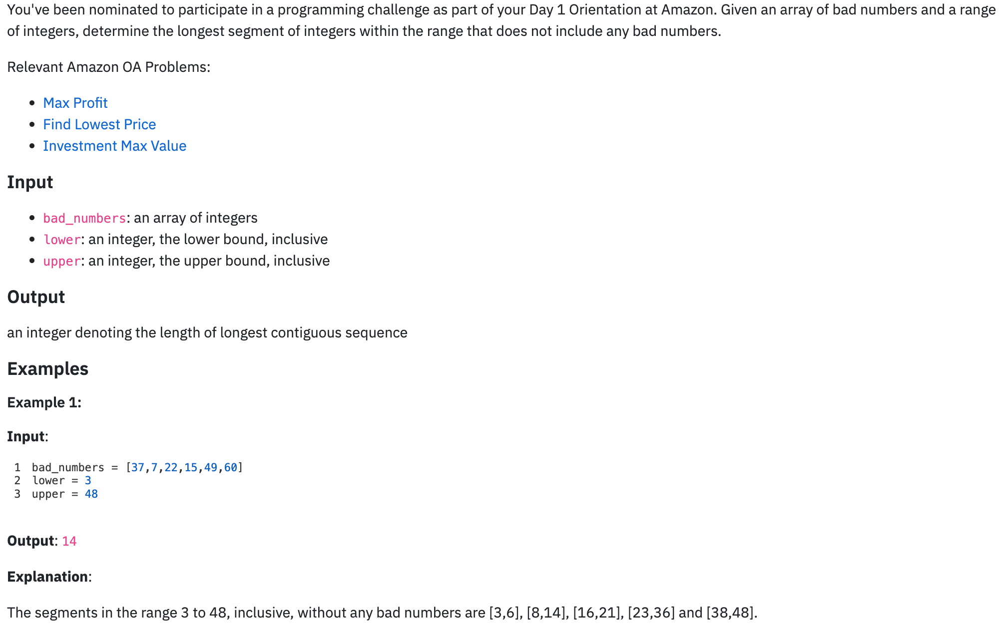

43. **Max number of engineering team greedy**

    + https://cybergeeksquad.co/2022/02/count-maximum-teams-amazon-oa.html

    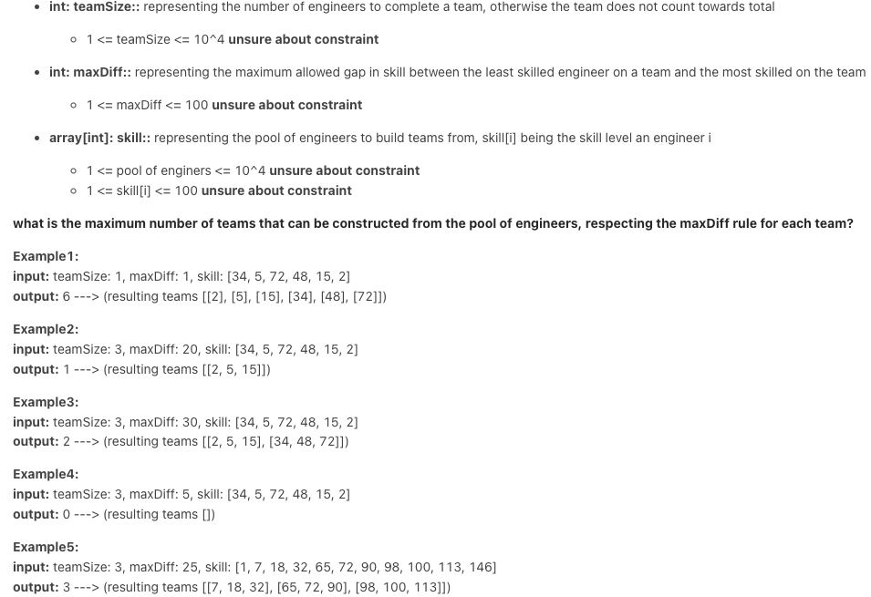

44. **Flip Coin**

     

47. **Package shipping system**

    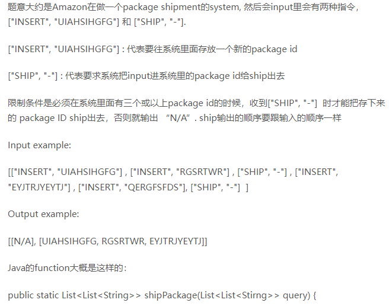

48. **Optimal Utilization Solution**

    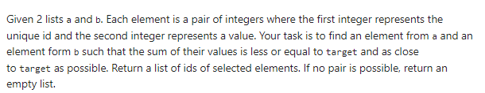

    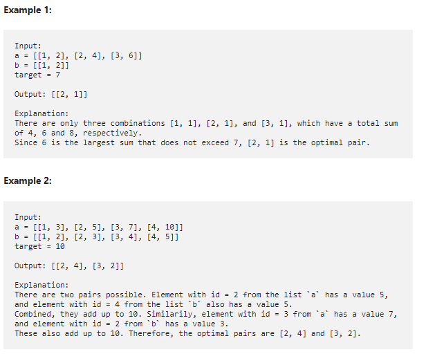

49. [1761. Minimum Degree of a Connected Trio in a Graph / Shopping Pattern](https://leetcode.com/problems/minimum-degree-of-a-connected-trio-in-a-graph/)

50. **wheel cipher**

    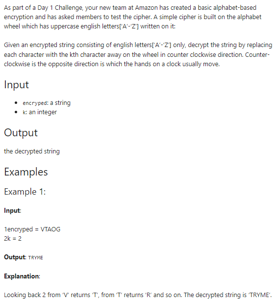

51. **Decode String**

    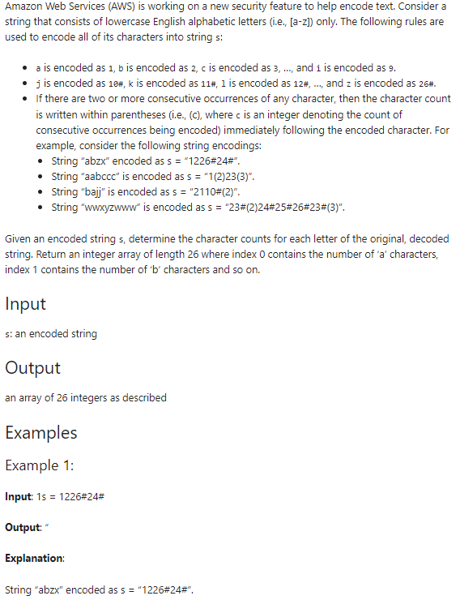

51. **Trees Heights**

     + [solution](https://cybergeeksquad.co/2021/09/trees-height-solution-amazon-oa-sde.html)

     

53. **Count Binary substring (group 0 and 1)**

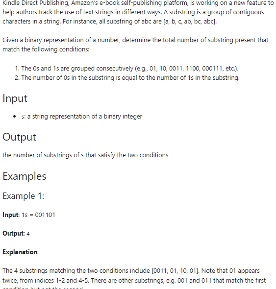

54. **Grid Connection**

    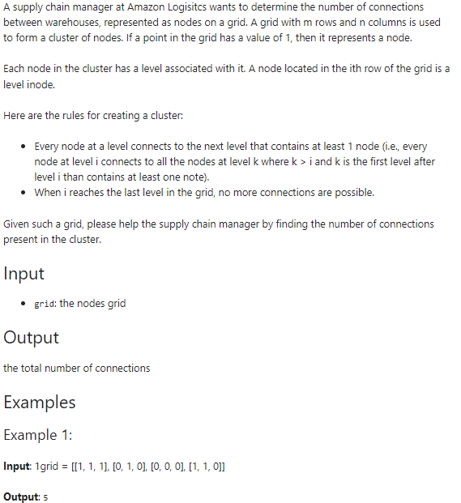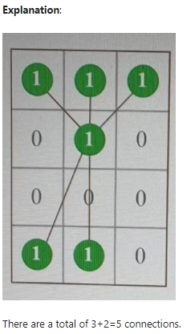

    55. **split int into primes**

        

55. **Number Game (GCD)** / [1799. Maximize Score After N Operations](https://leetcode.com/problems/maximize-score-after-n-operations/)

    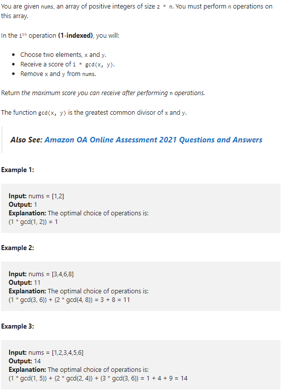

56. **Arrange keypad**

    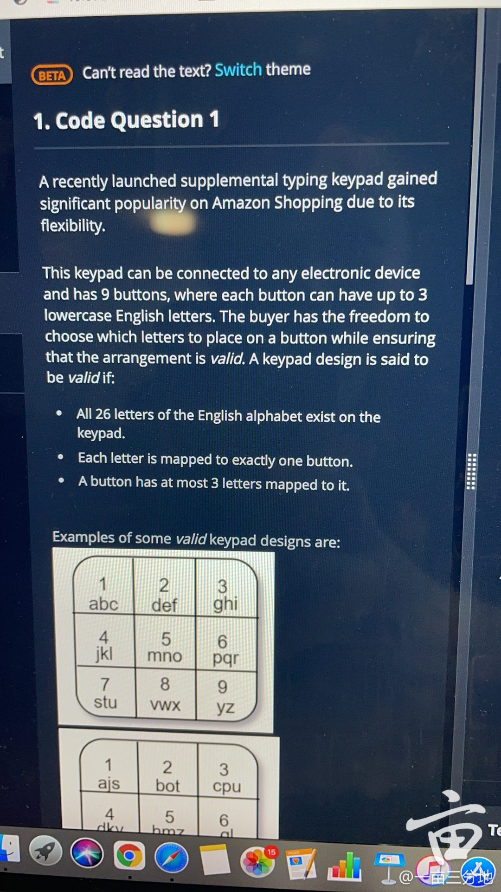

57. **cumulative observable sum**

    

58. [1846. Maximum Element After Decreasing and Rearranging](https://leetcode.com/problems/maximum-element-after-decreasing-and-rearranging)

59. [**Common prefix length**](https://leetcode.com/discuss/interview-question/851513/Roblox-New-Grad-2021-OA-Hackerrank/875522)

    

60. **number of subarray with at most K odd numbers**

    https://leetcode.com/discuss/interview-question/1566189/amazon-oa-intern-distinct-subarrays-having-at-most-k-odd-elements

    https://www.1point3acres.com/bbs/thread-812163-1-1.html

61. **add 'A' or 'Z' to maximize the count of "AZ"**

    

62. **Deliver boxes**

    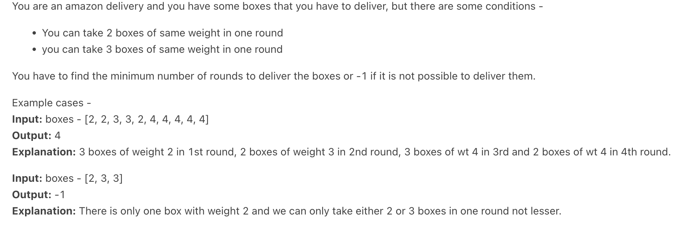