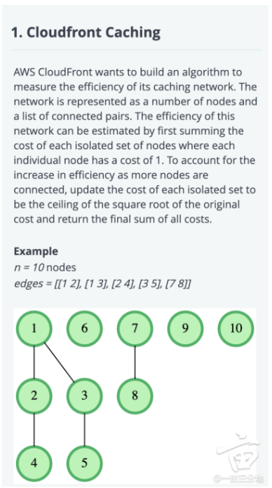
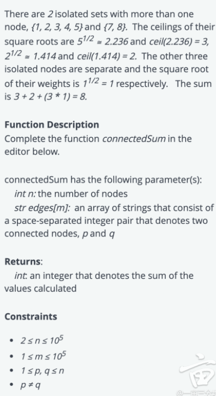
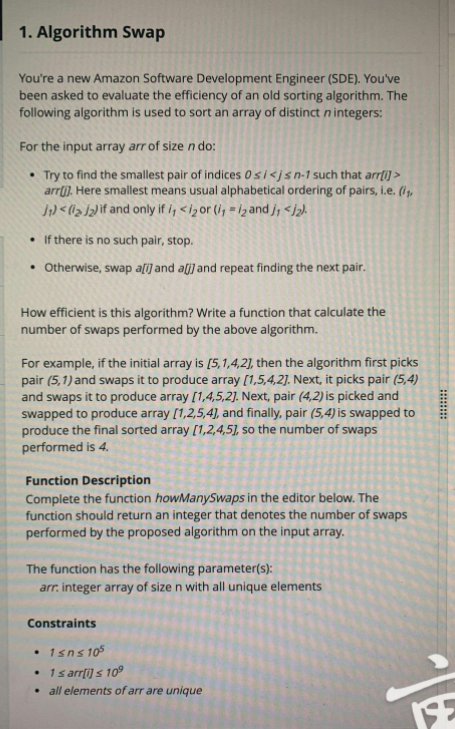
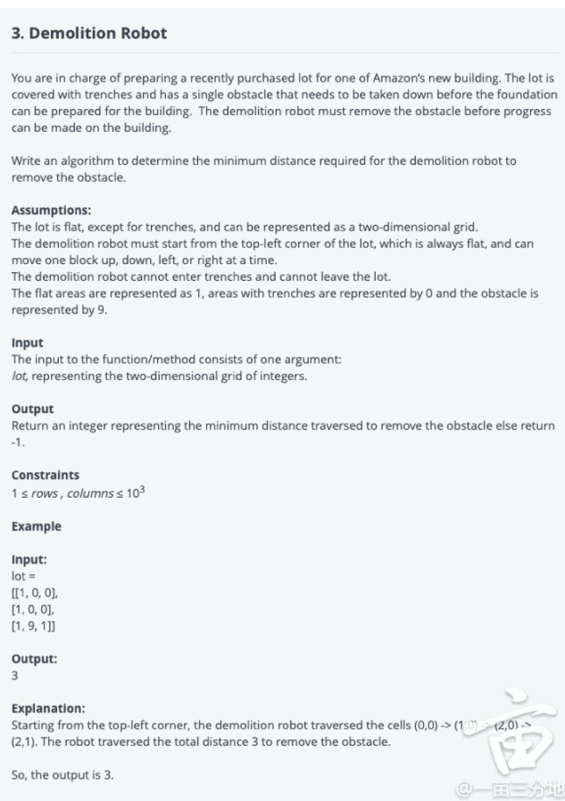
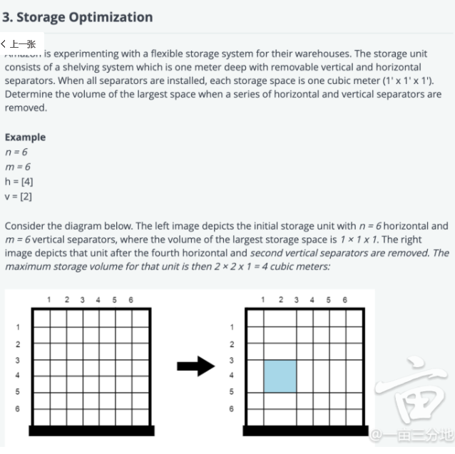
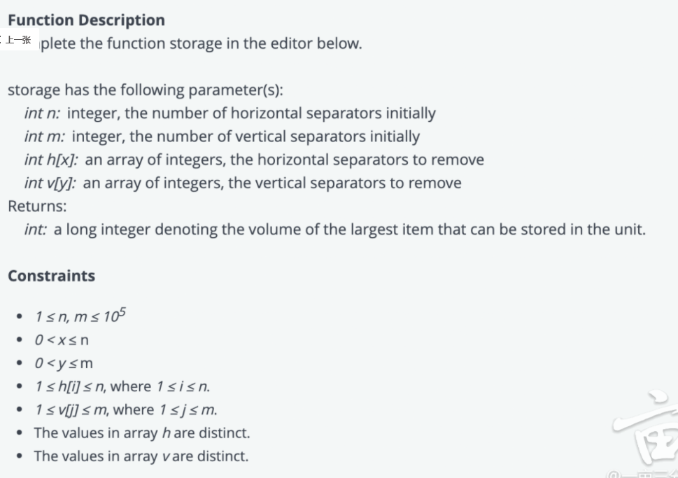

Amazon

1. [1710. Maximum Units on a Truck -- Easy](https://leetcode.com/problems/maximum-units-on-a-truck/)/ load_cargo

2. [Find the Highest Profit](https://algo.monster/problems/find_the_highest_profit)

3. [Items in Containers /  Items in compartment](https://algo.monster/problems/items_in_containers) +++

4. [1010. Pairs of Songs With Total Durations Divisible by 60 -- Medium](https://leetcode.com/problems/pairs-of-songs-with-total-durations-divisible-by-60/)

5. [Optimal Utilization](https://leetcode.com/discuss/interview-question/373202) ++ / [Prime Air time](https://leetcode.com/discuss/interview-question/1025705/Amazon-or-OA-or-Prime-Air-time)++

6. [1167. Minimum Cost to Connect Sticks](https://leetcode.com/problems/minimum-cost-to-connect-sticks/)

7. [Cost Evaluation](https://aonecode.com/oa-cloudfront-caching) / [CloudFront Caching](https://leetcode.com/discuss/interview-question/1144843/amazon-oa-april-2021-storage-optimization-cloudfront-caching) ++++++

   

8. [1041. Robot Bounded in circle](https://leetcode.com/problems/robot-bounded-in-circle/) +++++++++++

9. [Movies on Flight](https://leetcode.com/discuss/interview-question/313719/Amazon-or-Online-Assessment-2019-or-Movies-on-Flight) +++

10. [Algorithm Swap](https://www.1point3acres.com/bbs/thread-753362-1-1.html) /[\315. Count of Smaller Numbers After Self](https://leetcode.com/problems/count-of-smaller-numbers-after-self/)

    

    + https://leetcode.com/discuss/interview-question/1031247/Amazon-or-OA-or-No.-of-swaps

11. [1197. Minimum Knight Moves ](https://leetcode.com/problems/minimum-knight-moves/) ++

12. [937. Reorder Data in Log Files](https://leetcode.com/problems/reorder-data-in-log-files/) ++

13. [Demolition Robot](https://www.1point3acres.com/bbs/thread-753210-1-1.html)+++

    https://leetcode.com/discuss/interview-question/1033264/amazon-oa-1-year-experienced-for-sde1



14. [973. K Closest Points to Origin](https://leetcode.com/problems/k-closest-points-to-origin/) +++ /[Amazon Fresh Deliveries](https://leetcode.com/discuss/interview-question/1033264/Amazon-or-OA-or-1-year-Experienced-for-SDE1) MaxHeap
15. [1099. Two Sum Less Than K ](https://leetcode.com/problems/two-sum-less-than-k/)
16. [TransactionLog ](https://www.1point3acres.com/bbs/thread-752062-1-1.html)++++++
    + https://leetcode.com/discuss/interview-question/989768/Amazon-or-OA-2020-or-Transaction-logs
    + https://leetcode.com/discuss/interview-question/912928/amazon-oa-2020-gifting-groups-friend-circle-lc-doesnt-solve-this
    + https://leetcode.com/discuss/interview-question/989768/Amazon-or-OA-2020-or-Transaction-logs

17. [Optimize Box weight](https://algo.monster/problems/optimizing_box_weights) +++
18. Storage Optimzation +++





19. [Shopping Option](https://algo.monster/problems/amazon_oa_find_all_combination_of_numbers_sum_to_target)/[Jeans,Shoes,Skirts, and Tops](https://leetcode.com/discuss/interview-question/928404/question-asked-in-bny-mellon-forsde) +++

+ 每个list选一个，最后加起来价格小于等于budget的方案有几个
  list1 = [4]
  list2 = [3, 4]
  list3 = [1, 2]
  list4 = [2, 1]
  budget = 10
  最后 return 4， 因为有四种 组合， [4,3,1,1], [4,3,1,2], [4,3,2,1], [4,4,1,1]

```java
public static int waystoBuy(int[] jeans,int[] shoes,int[] skirts,int[] tops,int budget){
        List<Integer> sumJeansShoes = new ArrayList<>();
        for(int i=0;i<jeans.length;i++){
            for(int j=0;j<shoes.length;j++){
                if(jeans[i]+shoes[j]<budget)
                    sumJeansShoes.add(jeans[i]+shoes[j]);
            }
        }
        Collections.sort(sumJeansShoes);
        List<Integer> sumSkirtsTops = new ArrayList<>();
        for(int i=0;i<skirts.length;i++){
            for(int j=0;j<tops.length;j++){
                if(skirts[i]+tops[j]<budget)
                    sumSkirtsTops.add(skirts[i]+tops[j]);
            }
        }
        Collections.sort(sumSkirtsTops);
        int numways=0;
        for(int i=0;i<sumJeansShoes.size();i++){
            for(int j=0;j<sumSkirtsTops.size();j++){
                if(sumJeansShoes.get(i) + sumSkirtsTops.get(j)<=budget)
                    numways++;
                else
                    break;
            }
        }
        
            return numways;
        }
```

20. [239 Sliding Window Maximum](https://leetcode.com/problems/sliding-window-maximum/) +++

21. other

  +  https://www.1point3acres.com/bbs/thread-546575-1-1.html 2019-8